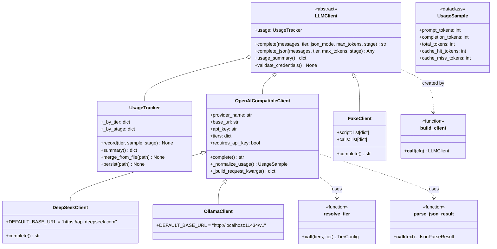
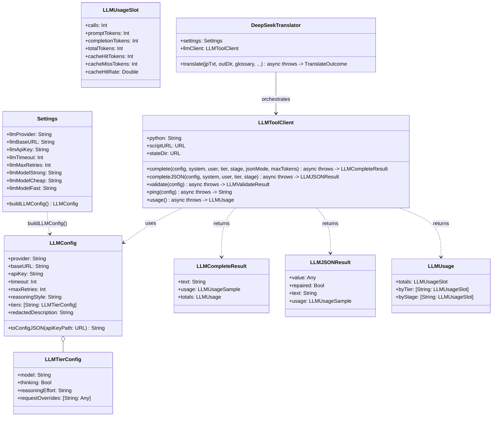
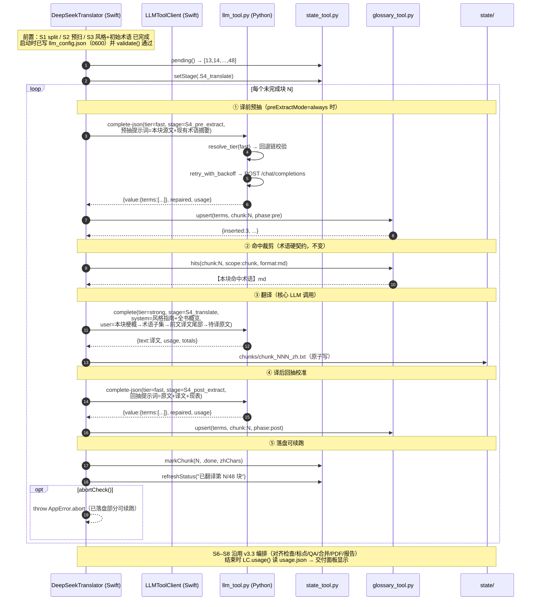
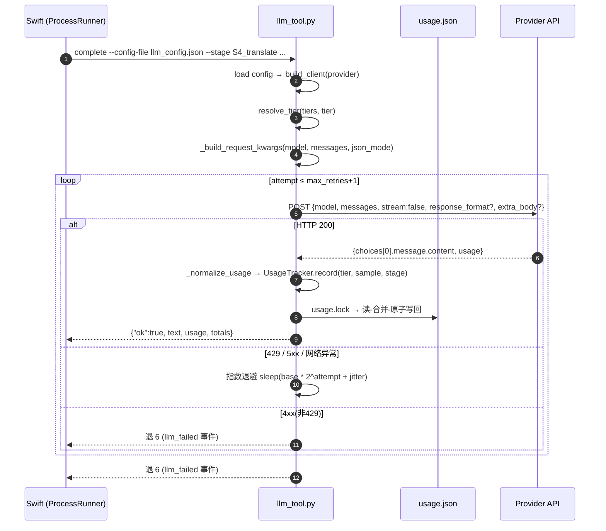
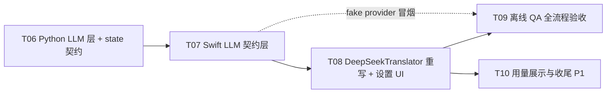

# JaPdfOcrTranslator v3.3 — 增量设计 ②：DeepSeek 后端 LLM 底层 wenyi 化（多 Provider）

> 本文件是 `DESIGN-v3.3.md` 的**追加增量**，只覆盖「DeepSeek 后端 LLM 底层升级」。
> 既有 v3.3 契约（`state/`、`glossary_tool.py`、`state_tool.py`、S0–S8 九阶段、`events.jsonl`、
> `params_sha256` 续跑判定、退出码语义、D2 红线「Swift 永不写 glossary.json」）**一律不破坏**，本设计只在其上扩展。
> 用户原话：「将 3.3 版本的 DeepSeek 翻译底层变成与 wenyi 相同的底层，使其能自由调用 api 进行翻译，参考 wenyi 进行功能的实现。」

---

## 1. 实现方案总述

### 1.1 一句话架构

> 新增 **`llm_tool.py`**（纯标准库 Python，零第三方依赖）作为 **wenyi `trans_novel/llm/` 层**的语义等价移植：
> 多 provider 工厂 + 三档模型回退链 + 指数退避重试 + 用量统计 + JSON 宽���解析。
> Swift 侧通过 `ProcessRunner` 子进程调用（与 OCR 引擎、glossary_tool 同构），
> 逐块翻译的 ①②③④⑤ 编排仍由 **Swift `DeepSeekTranslator`** 驱动，**保留 S0–S8 与术语硬契约**。

### 1.2 关键选型与理由（Q-LLM1 拍板）

**决策 L1：底层形态 = (a) 纯标准库 Python 引擎化，不做 (b) Swift 原生重写。**

| 维度 | (a) Python 引擎化（采用） | (b) Swift 原生重写（否决） |
|---|---|---|
| wenyi 语义对齐 | **逐字对齐**（直接对照 wenyi llm 层移植） | 概念翻译，语义必然漂移 |
| 与现有架构同构 | 与 OCR 引擎 / glossary_tool / state_tool 完全一致（Swift 壳 + Python 引擎） | 引入第二套「Swift 直连 API」模式，与 D2 精神冲突 |
| 可测试性 | `fake` provider 离线全流程验证 | Swift 单测要 mock URLSession |
| 环境约束 | **纯 stdlib 即可**（urllib/json/ssl/random/time），**无需 pip 装 SDK** | 无此问题，但等于重写 wenyi 的 tenacity/json-repair 生态 |
| 结论 | ✅ 采用 | ❌ 否决 |

**决策 L2：第三方依赖 = 零新增（铁律）。** wenyi 用 `openai SDK + pydantic + tenacity + json-repair + httpx`；
本应用 Python 环境是受限自举（`PythonBootstrap` 只保证 OCR 依赖，skill 脚本 D7 零依赖），
所以本设计**逐项手写语义等价物**：

| wenyi 依赖 | 本设计替代 | 语义等价点 |
|---|---|---|
| `openai` SDK | `urllib.request` + 手写 JSON 序列化 | Chat Completions 请求/响应（`choices[0].message.content`、`usage`） |
| `tenacity` | 手写 `retry_with_backoff`（指数退避 + 抖动 + 可配 max_retries） | `stop_after_attempt(max_retries+1)`、`wait_exponential(multiplier=1, max=30)` |
| `pydantic` | 纯 dict + `normalize_*` 校验函数 | `LLMConfig`/`TierConfig` 字段校验与默认值 |
| `json-repair` | 手写 `repair_json`（见 §4.6，覆盖本应用高频畸形） | `repaired` 标记 + `parse_json_result` 语义 |
| `httpx` | `urllib.request` | 同进程内串行调用，无并发需求 |

### 1.3 与 wenyi 的对应关系（照搬哪些、裁剪哪些）

| wenyi 文件 | 本设计落点 | 说明 |
|---|---|---|
| `llm/base.py` | `_llm_common.py` `LLMClient` 抽象 | 保留 `complete` / `complete_json` / `usage_summary` / `validate_credentials` |
| `llm/factory.py` | `_llm_common.py` `build_client(cfg)` | **裁剪 provider 集合**：保留 `deepseek` / `openai` / `openrouter` / `openai-compatible` / `ollama` / `vllm` / `gemini` / `fake` 全部 8 个（其中 gemini/vllm/openai 可 P1 再点亮，P0 必保 deepseek + openai-compatible + ollama + fake） |
| `llm/tiers.py` | `_llm_common.py` `resolve_tier` | **逐字照搬**：`_TIER_FALLBACK = {"fast": ("cheap","strong"), "cheap": ("strong",), "strong": ()}`，只降不升 |
| `llm/usage.py` | `_llm_common.py` `UsageTracker` | 语义照搬（calls/prompt/completion/total/cache_hit/cache_miss + by_tier/by_stage + hit_rate）；**去掉 threading**（子进程单线程），**持久化到 `state/usage.json`**（wenyi 是内存态，本应用要求落盘） |
| `llm/json_parser.py` | `_llm_common.py` `parse_json_result` / `parse_json_loose` | 语义照搬；`repair_json` 为手写实现（§4.6） |
| `llm/providers/_openai_compatible.py` | `_llm_common.py` `OpenAICompatibleClient` | 照搬：JSON 模式指令双保险（system + 最后一条 user）、`deep_merge`、缓存明细归一化 |
| `llm/providers/deepseek.py` | `_llm_common.py` `DeepSeekClient` | 照搬 thinking 模式（`extra_body.thinking = {type: enabled/disabled}` + `reasoning_effort`）+ DeepSeek 顶层缓存字段（`prompt_cache_hit_tokens`/`prompt_cache_miss_tokens`） |
| `llm/providers/ollama.py` | `_llm_common.py` `OllamaClient` | 默认 `http://localhost:11434/v1`，免 key |
| `llm/providers/fake.py` | `_llm_common.py` `FakeClient` | **保留并扩展**：支持按 stage/chunk 返回可编程响应（离线 QA 全流程验证） |

### 1.4 不改动既有契约的证明（兼容性清单）

| 既有契约 | 本设计影响 |
|---|---|
| `state/config.json` | **扩展** `llm` 块（§3.2）；`params` 增 `llm_provider` 字段（供续跑判定） |
| `state/status.json` | 不变（LLM 调用仍走 ③ markChunk 计数） |
| `state/events.jsonl` | **扩展**事件枚举：`llm_call` / `llm_failed`（§3.4） |
| `state/glossary*.json` | 不变。**D2 红线保持**：术语语义仍在 `glossary_tool.py`，llm_tool **只读** hits 结果、**不写** glossary |
| `glossary_tool.py` CLI | 不变 |
| `state_tool.py` CLI | `verify` 的 `stage-artifacts` 检查扩展：S4 要求 `usage.json` 存在（§3.3） |
| S0–S8 九阶段 / 退出码语义 | 不变 |
| `SkillRegistry.requiredScripts` | **13 → 15**（新增 `_llm_common.py`、`llm_tool.py`） |

---

## 2. 完整文件清单

> 状态：🆕新增 / 🔧修改 / ♻️沿用（零改动）。路径相对 `JaPdfOcrTranslator-Swift-v33/`。

### 2.1 文档
| 路径 | 状态 | 职责 |
|---|:---:|---|
| `docs/DESIGN-v3.3-llm.md` | 🆕 | 本文档 |
| `docs/llm-class-diagram.mermaid` | 🆕 | §5 类图抽出 |
| `docs/llm-sequence-diagram.mermaid` | 🆕 | §6 时序图抽出 |
| `docs/llm-task-dependency.mermaid` | 🆕 | §8 任务依赖图抽出 |
| `docs/DESIGN-v3.3.md` | ♻️ | 主设计不动（本文件是增量） |
| `README.md` | 🔧 | 补「DeepSeek 后端多 Provider」说明 |

### 2.2 skill — 脚本（`Sources/JaPdfOcrTranslator/Resources/skills/jp-txt2pdf-translator/scripts/`）
| 路径 | 状态 | 职责（纯确定性） | 依赖 |
|---|:---:|---|---|
| `_llm_common.py` | 🆕 | LLM 共用底座：`LLMClient` 抽象、`build_client` 工厂、`resolve_tier`、`UsageTracker`、`parse_json_result`/`repair_json`、`OpenAICompatibleClient`/`DeepSeekClient`/`OllamaClient`/`FakeClient`、`retry_with_backoff`、`read_usage_int`/`make_usage_sample`/`normalize_openai_usage`/`normalize_deepseek_usage` | 无 |
| `llm_tool.py` | 🆕 **核心** | LLM 层 CLI：`complete` / `complete-json` / `validate` / `usage` / `ping`（§4） | 无 |
| `_common.py` | 🔧 | 事件枚举补 `llm_call` / `llm_failed` 常量；`SKILL_VERSION` 不变（3.3.0 同一版本内增量，不改 frontmatter 版本号） | 无 |

> ⚠️ **`requiredScripts` 扩为 15 项**（新增 2 项，顺序追加在末尾）：
> ```swift
> static let requiredScripts = [
>     "_common.py", "state_tool.py", "glossary_tool.py",
>     "split_text.py", "sample_text.py", "reduce_digests.py",
>     "check_boundaries.py", "check_alignment.py", "normalize_punct.py",
>     "qa_consistency.py", "merge.py", "make_report.py", "build_pdf.py",
>     "_llm_common.py", "llm_tool.py"
> ]
> ```
> 该清单在 `Core/SkillRegistry.swift`（T07-h 中修改）。`SKILL.md` **不改**（LLM 层是应用内后端，不属于 Agent 工作流；SKILL.md 的九阶段流程不涉及 llm_tool 调用）。

### 2.3 Swift — Core
| 路径 | 状态 | 职责 |
|---|:---:|---|
| `Core/LLMToolClient.swift` | 🆕 | `llm_tool.py` 子命令的类型化封装（子进程 + JSON 编解码 + 退出码映射） |
| `Core/Paths.swift` | 🔧 | 新增 `usageFile(state:)`、`llmConfigFile(outDir:)`（写临时配置用） |
| `Core/ProcessRunner.swift` | ♻️ | 复用 T01-d 的 `runCapturing` |
| `Core/SkillRegistry.swift` | 🔧 | `requiredScripts` 15 项（B1 单向 isSynced 等 v3.3 既有修改保持） |
| `Core/Errors.swift` | 🔧 | 新增 `case llmTool(String)`；复用 `state`/`glossaryTool` |

### 2.4 Swift — Models
| 路径 | 状态 | 职责 |
|---|:---:|---|
| `Models/LLMConfig.swift` | 🆕 | provider/base_url/api_key_env/api_key/timeout/max_retries/reasoning_style/tiers(strong/cheap/fast + options) 的 Codable；`toConfigJSON()`；`redactedDescription`（打码日志） |
| `Models/LLMUsage.swift` | 🆕 | `usage.json` 的 Codable 映射 + `totalCostEstimate()`（P1，按 provider 单价表） |
| `Models/Settings.swift` | 🔧 | 新增 LLM 字段（§3.5）+ 旧 `deepseek*` 字段兼容映射 + `canResumeWithLLM` |
| `Models/RunConfig.swift` | 🔧 | `params` 增 `llm_provider`；`llm` 块校验（`schema_version` 仍 1） |
| `Models/GlossaryPolicy.swift` | ♻️ | 不变 |
| `Models/TranslationState.swift` | ♻️ | 不变 |

### 2.5 Swift — Translate / UI
| 路径 | 状态 | 职责 |
|---|:---:|---|
| `Translate/DeepSeekClient.swift` | 🔧 **删除** | v3.2 遗留直连客户端；由 `LLMToolClient` 取代（删除，不再编译） |
| `Translate/DeepSeekTranslator.swift` | 🔧 **重写** | S1–S8 编排不变；所有 LLM 调用改走 `LLMToolClient`；新增逐块 `complete` 调用（§6.2）；`bilingual` 仍强制 false |
| `Translate/TranslationPrompts.swift` | 🔧 | 增 `llmPreExtractPrompt` / `llmPostExtractPrompt` / `llmTranslateSystemPrompt`（与 v3.3 §7.2 策略文案衔接；`render` 注入顺序不变） |
| `Translate/Translator.swift` | 🔧 | `TranslateOutcome` 增 `llmUsagePath: URL?` |
| `UI/SettingsView.swift` | 🔧 | 新增「LLM Provider」分组：provider Picker + base_url + api_key（SecureField）+ 三档 model + timeout/max_retries + reasoning_style + 「测试连接」按钮（调 `llm_tool.py ping`） |
| `UI/Components.swift` | 🔧 | 新增 `ProviderBadge`（provider + tier 徽标） |
| `UI/MainView.swift` | 🔧 | 交付面板显示用量摘要（calls / tokens / 各档分布，读 `usage.json`） |
| `App/AppState.swift` | 🔧 | 启动 LLM 配置校验（`llm_tool.py validate` 失败 → 弹窗）；翻译结束后刷新用量摘要 |

### 2.6 skill — 参考文档（`references/`）
| 路径 | 状态 | 职责 |
|---|:---:|---|
| `references/llm_providers.md` | 🆕 | 8 个 provider 的配置示例（base_url/api_key_env/档位建议/推理方言），供设置页帮助与用户自查 |

---

## 3. `state/` 增量规范

### 3.1 目录树（增量部分）

```
state/
├── usage.json                    🆕 LLM 用量累计（totals + by_tier + by_stage）
├── llm_config.json               🆕 单次运行的 LLM 配置快照（Swift 启动时写入；含 api_key，权限 0600）
└── .locks/
    └── usage.lock                🆕 usage.json 的写锁（与 glossary.lock 同模式）
```

### 3.2 `config.json` 增量

**新增 `llm` 块**（`schema_version` 仍为 1，读到 >1 报错逻辑不变）：

| 字段 | 类型 | 说明 |
|---|---|---|
| `llm.provider` | string | `deepseek` \| `openai` \| `openrouter` \| `openai-compatible` \| `ollama` \| `vllm` \| `gemini` \| `fake` |
| `llm.base_url` | string | 为空时用 provider 默认 |
| `llm.api_key_env` | string? | 环境变量名（如 `DEEPSEEK_API_KEY`），二选一：`api_key_env` 或 `api_key`（见下） |
| `llm.api_key` | string? | 直接给 key（Swift 从 Settings 读入）；**写 `llm_config.json` 而非 config.json**（config.json 公开可 diff，不存密） |
| `llm.timeout` | int | 默认 120 |
| `llm.max_retries` | int | 默认 4（`stop_after_attempt = max_retries + 1`） |
| `llm.reasoning_style` | string | `none` \| `deepseek` \| `openai` \| `openrouter`（默认 `deepseek`） |
| `llm.tiers.strong/cheap/fast` | object | `{model, options{thinking, reasoning_effort, request_overrides}}` |

**`params` 增字段**（纳入 `params_sha256` 计算，**不兼容旧 runs**——见 §11 U-LLM3）：

| 字段 | 默认 | 说明 |
|---|---|---|
| `llm_provider` | `"deepseek"` | 切换 provider 即参数哈希变化 → 旧 run 不可续跑（**期望行为**，输出口径变了） |

### 3.3 `state/usage.json`（Q-LLM3 落点）

```
{
  "schema_version": 1,
  "updated_at": 1754000400.0,
  "totals": {"calls": 137, "prompt_tokens": 812340, "completion_tokens": 295100,
             "total_tokens": 1107440, "cache_hit_tokens": 220000, "cache_miss_tokens": 592340,
             "cache_hit_rate": 0.2709},
  "by_tier": {
     "strong":  {"calls": 12, "prompt_tokens": ..., "completion_tokens": ..., "total_tokens": ...,
                 "cache_hit_tokens": ..., "cache_miss_tokens": ..., "cache_hit_rate": ...},
     "cheap":   {...},
     "fast":    {...}
  },
  "by_stage": {
     "S4_pre_extract":   {...},
     "S4_translate":     {...},
     "S4_post_extract":  {...},
     "S2_synopsis":      {...},
     "S3_style":         {...},
     "S6_retranslate":   {...}
  }
}
```
- 字段语义**照搬 wenyi `_usage_summary`**：totals 仅由 by_tier 累加；by_stage 是同一用量的另一种归因。
- 写入：`llm_tool.py` 每次调用在 `usage.lock` 内 **读-合并-原子写回**（增量合并语义照搬 wenyi `merge_usage_summaries`）。
- Swift 只读展示；`make_report.py` 在 S8 把用量摘要写进 `report.md`（可选 P1）。

### 3.4 `events.jsonl` 增量事件

| 事件 | 字段 | 说明 |
|---|---|---|
| `llm_call` | `data:{provider, model, tier, stage, json_mode, prompt_tokens, completion_tokens, total_tokens, cache_hit_tokens, cache_miss_tokens, repaired}` | 每次成功 LLM 调用；`repaired` 标记 JSON 是否被修复 |
| `llm_failed` | `data:{provider, tier, stage, attempts, error_type, error}` | 重试耗尽失败（`attempts` = 实际尝试次数） |

### 3.5 `Settings.swift` 新增字段（Q-LLM3 安全建议）

| 字段 | 默认 | 说明 |
|---|---|---|
| `llmProvider` | `"deepseek"` | |
| `llmBaseURL` | `""`（空=provider 默认） | |
| `llmApiKey` | `""` | **本轮仍存 Settings.json（与 v3.2 一致），但**：① 写 `llm_config.json` 时权限 0600；② 日志一律 `redactedDescription`；③ 建议项 U-LLM2 在 v3.4 迁 Keychain |
| `llmTimeout` | `120` | |
| `llmMaxRetries` | `4` | |
| `llmReasoningStyle` | `"deepseek"` | |
| `llmModelStrong` / `llmModelCheap` / `llmModelFast` | 见 §4.5 默认表 | 三档 model 均可自由填 |
| `llmTierStrongThinking` / `llmTierCheapThinking` / `llmTierFastThinking` | `true/true/false` | 各档 thinking 开关 |

**兼容映射**：`llmApiKey` 为空时回退 `deepseekApiKey`（v3.2 字段）；`llmModelStrong` 为空时回退 `deepseekModel`；`llmBaseURL` 为空时回退 `deepseekBaseURL`。迁移后在设置页提示一次「已升级为多 Provider 配置」。

---

## 4. `llm_tool.py` CLI 契约

### 4.0 通用约定

| 项 | 约定 |
|---|---|
| 调用形式 | `$PY $SKILL/llm_tool.py <subcommand> --state <state_dir> [options]` |
| `--state` | 必填；llm_tool 自建 `.locks/`；写 `usage.json`/事件 |
| `--config-json <json>` 或 `--config-file <path>` | LLM 配置（§3.2 `llm` 块），二选一必填；**api_key 走 `--config-file`（0600 临时文件）或 `--api-key-env`，不出现于 argv** |
| stdout | 一律单个 JSON 对象（除 `ping` 的 `--format text` 外），无多余打印 |
| 编码 | 全链路 UTF-8；输入 JSON 允许 BOM |
| 锁 | 写 `usage.json`/事件时持 `.locks/usage.lock` 的 `LOCK_EX`（与 glossary.lock 同模式）；`state.lock` 复用 |
| 原子性 | 单次子命令 = 一个事务：请求 → 解析 → 合并用量 → 原子写回 usage + event。任一步异常不落盘 |

**退出码**（延续 v3.3 语义，新增 6）：

| 码 | 含义 | 场景 |
|:---:|---|---|
| `0` | 成功（业务结果在 stdout JSON） | 正常 |
| `1` | 用法/参数错误 | 缺参、互斥参数同时给出 |
| `2` | IO / 锁错误 | 目录不可写、锁超时（30s） |
| `3` | 输入 JSON 畸形 | `--config-json` 非法 |
| `4` | 状态未初始化 / 目标不存在 | `state/` 缺失、`usage.json` 缺失（`usage` 子命令） |
| `5` | 凭据/配置校验未通过 | `validate` 子命令（缺 key、缺 strong tier） |
| `6` | LLM 调用重试耗尽 | 网络/HTTP≥500/JSON 解析失败超过 max_retries |

### 4.1 `complete` — 纯文本补全

```bash
llm_tool.py complete --state <dir> --config-file <path>
                     [--tier {strong|cheap|fast}] [--stage S4_translate]
                     [--max-tokens N] [--json-mode] [--no-event]
                     --system <text> --user <text>
                     # 或 --messages-json '<[...]>'（多轮消息）
```
- 构造 Chat Completions 请求（§4.5 请求方言）；`--json-mode` 时自动：`response_format={"type":"json_object"}` + system 与最后一条 user 双保险注入 `Output must be valid json.`（照搬 wenyi `base_request_kwargs`）。
- 重试：`retry_with_backoff(attempts=max_retries+1, base=1.0, max=30, jitter=0.2)`，重试条件：网络异常 / HTTP 429、5xx / JSON 模式响应解析失败。**HTTP 4xx（除 429）不重试**，直接退 6。
- 用量：`_normalize_usage`（deepseek 顶层缓存字段 / openai 兼容嵌套 `prompt_tokens_details.cached_tokens`）→ `UsageTracker.record(tier, sample, stage)` → 合并写回 `usage.json`。
- stdout：
```json
{"ok":true,"provider":"deepseek","model":"deepseek-chat","tier":"fast","stage":"S4_translate",
 "text":"<译文>","usage":{"prompt_tokens":812,"completion_tokens":295,"total_tokens":1107,
 "cache_hit_tokens":100,"cache_miss_tokens":712},"totals":{"calls":137,"total_tokens":1107440}}
```
- 事件：`llm_call`（成功）/ `llm_failed`（重试耗尽）。

### 4.2 `complete-json` — JSON 模式补全（宽松解析）

```bash
llm_tool.py complete-json --state <dir> --config-file <path>
                          [--tier ...] [--stage ...] [--max-tokens N]
                          --system <text> --user <text>
```
- = `complete --json-mode` + `parse_json_loose`（§4.6）。stdout 增加 `repaired` 字段：
```json
{"ok":true,"repaired":true,"value":{...},"text":"<原始模型输出>","usage":{...},"totals":{...}}
```
- `repaired=true` 且解析失败 → 重试；重试耗尽退 6。

### 4.3 `validate` — 凭据与配置校验

```bash
llm_tool.py validate --state <dir> --config-file <path>
```
- 检查：provider 已知；`strong` tier 存在（照搬 `resolve_provider_tiers` 的 `strong 缺失即 ValueError`）；需要 key 的 provider 有 key；`base_url` 非空（或 provider 有默认）。
- 不发网络请求。stdout：`{"ok":true,"provider":"deepseek","requires_api_key":true,"has_api_key":true,"tiers":["strong","cheap","fast"]}`
- 不通过退 **5**。

### 4.4 `ping` / `usage`

```bash
llm_tool.py ping --state <dir> --config-file <path> [--format {json|text}]
llm_tool.py usage --state <dir> [--format {json|md}]
```
- `ping`：发一次 `max_tokens=8` 的最小调用（`stage="ping"`），成功退 0；**供设置页「测试连接」按钮**。
- `usage`：只读 `usage.json`（缺文件退 4），`md` 格式供报告/日志。

### 4.5 Provider 默认配置与请求方言（照搬 wenyi）

| provider | 默认 base_url | 默认 api_key_env | requires_api_key | 推理方言 |
|---|---|---|---|---|
| `deepseek` | `https://api.deepseek.com` | `DEEPSEEK_API_KEY` | ✅ | `extra_body.thinking={type:enabled/disabled}` + `reasoning_effort`（thinking 时）；`max_tokens = max(max_tokens, 4096)`（thinking 时） |
| `openai` | `https://api.openai.com/v1` | `OPENAI_API_KEY` | ✅ | `reasoning_effort`（thinking 时） / `"none"`；`max_completion_tokens` |
| `openrouter` | `https://openrouter.ai/api/v1` | `OPENROUTER_API_KEY` | ✅ | `extra_body.reasoning={effort:...}` / `{enabled:false}` |
| `openai-compatible` | 无（必填） | 用户填 | 可配 | `reasoning_style` 决定（none/deepseek/openai/openrouter） |
| `ollama` | `http://localhost:11434/v1` | 无 | ❌ | 无（兼容模式） |
| `vllm` | 无（必填） | 可配 | 可配 | 无 |
| `gemini` | `https://generativelanguage.googleapis.com/v1beta/openai` | `GEMINI_API_KEY` | ✅ | 兼容模式 |
| `fake` | — | — | ❌ | 可编程响应（§4.7） |

**三档默认模型**（deepseek provider）：
- `strong`: `deepseek-chat`（thinking=true, reasoning_effort=high）
- `cheap`: `deepseek-chat`（thinking=true, reasoning_effort=medium）
- `fast`: `deepseek-chat`（thinking=false）

> 注：wenyi 0.4.0 的默认模型名 `deepseek-v4-pro/flash` 为示例名；本应用按**实际可用名**设 `deepseek-chat`/`deepseek-reasoner` 语义（P0 用 `deepseek-chat` 全档，用户可自由改）。**不锁定模型名**，设置页可填任意兼容模型。

**档位回退（照搬 `resolve_tier`，只降不升）**：
```
resolve_tier(tiers, "fast")   → tiers["fast"] 或 tiers["cheap"] 或 tiers["strong"] 或 KeyError
resolve_tier(tiers, "cheap")  → tiers["cheap"] 或 tiers["strong"]
resolve_tier(tiers, "strong") → tiers["strong"]（缺失即错误）
```

### 4.6 `repair_json` — 手写宽松解析（替代 json-repair）

`parse_json_result(text) -> {value, repaired}`：
1. `json.loads` 成功 → `repaired=False`。
2. 失败 → 依次尝试以下**确定性修复**（每次成功后 `repaired=True`）：
   - a. 剥离 Markdown 代码围栏（```json … ``` / ~~~json … ~~~）；
   - b. 提取首个 `{` 到末个 `}`（或 `[` 到 `]`）之间的子串；
   - c. 删除**行尾逗号**（`,\s*[}\]\]]` → `\1`）；
   - d. 把**单引号**替换为双引号（`'(?=[^']*':)` 保守策略：仅键与值两侧）；
   - e. 对**未加引号键**补引号（`^\s*([A-Za-z_][A-Za-z0-9_]*)\s*:` → `"\1":`，逐行）；
   - f. 修复**字符串内裸换行**（`"…\n…"` → `\n` 转义为 `\\n`）。
3. 全部失败 → `ValueError("无法解析为 JSON：{text[:200]!r}")`。
> 覆盖度声明：本应用 JSON 输出高频畸形为「围栏」「尾逗号」「缺引号键」「单引号」四类，均在覆盖内；
> 与 json-repair 的完整覆盖有差距（已知缺口：深层嵌套修复、`NaN`/`Infinity` 处理、Python 字面量 dict），
> 见风险 R-LLM3。**不引入 json-repair 依赖**（环境限制）。

### 4.7 `fake` provider（Q-LLM4 落点）

`FakeClient` 扩展：`--config-file` 的 `llm.fake_script` 指向一个 **JSON 脚本文件**（每行一个响应规则）：
```jsonl
{"when":{"stage":"S4_pre_extract"},"respond":{"terms":[{"source":"御堂 静","target":"御堂静","type":"人物"}]}}
{"when":{"stage":"S4_translate","chunk":1},"respond":{"text":"第一章译文占位…"}}
{"when":{"stage":"ping"},"respond":{"text":"pong"}}
```
- 规则匹配：`stage` 精确 + `chunk` 可选 + `tier` 可选；未命中 → 默认 `[]`（json_mode）或 `""`。
- `fake` 无网络请求、不计费，但**照常**走完整调用管线（含 `usage` 归一化：Fake 返回固定 `usage` 样例）→ **QA 全流程离线可跑**。

---

## 5. 数据结构与接口（类图）

### 5.1 Python 侧（`_llm_common.py` + `llm_tool.py`）



### 5.2 Swift 侧



---

## 6. 程序调用流程（时序图）

### 6.1 DeepSeek 后端逐块翻译（新流程，替换 v3.3 §6.2 的 API 直连）



### 6.2 `llm_tool.py` 单次调用内部（`complete` 子命令）



---

## 7. 任务列表（T06 起）

> 5 个任务组。依赖：T06 → T07 → T08 → T09；T10 与 T08/T09 可并行（但建议 T08 后）。
> **T06/T07/T08/T09 为 P0**，T10 为 P1。



### T06 · Python LLM 层 + state 契约 ｜ P0 ｜ 依赖：无（与 T01–T05 并行安全）

**涉及文件**
`Resources/skills/.../scripts/_llm_common.py`🆕、`scripts/llm_tool.py`🆕、`scripts/_common.py`🔧（事件常量）、`state_tool.py`🔧（`verify` 增 usage.json 检查）、`docs/llm-class-diagram.mermaid`🆕

**步骤**
| # | 内容 | 契约出处 |
|---|---|---|
| a | `_llm_common.py`：`LLMClient` 抽象 + `build_client` 工厂（8 provider，P0 点亮 deepseek/openai-compatible/ollama/fake，openai/openrouter/vllm/gemini 骨架 + validate 通过即可） | §1.3 / §4.5 |
| b | `resolve_tier` 逐字照搬（只降不升回退链） | §4.5 |
| c | `UsageTracker`（无 threading）+ `usage.json` 读-合并-原子写回（`usage.lock`） | §3.3 / wenyi usage.py |
| d | `parse_json_result`/`repair_json` 手写实现（四类修复） | §4.6 |
| e | `retry_with_backoff`（指数退避 + 抖动；4xx 非 429 不重试） | §4.1 |
| f | `OpenAICompatibleClient`/`DeepSeekClient`/`OllamaClient`/`FakeClient` 请求方言与用量归一化 | §4.5 / wenyi providers |
| g | `llm_tool.py` 五个子命令（complete/complete-json/validate/ping/usage） | §4.1–§4.4 |
| h | `_common.py` 事件常量补 `llm_call`/`llm_failed`；`state_tool.py verify` 的 S4 产物检查增 `usage.json` | §3.4 / §3.3 |
| i | `docs/llm-class-diagram.mermaid` 抽出 §5.1 | §5 |

**编码约束**：禁止 import 任何第三方包（仅 stdlib）；与 wenyi 逐字对齐的部分写注释标注源文件。

**完成判据**
1. `python3 -m py_compile _llm_common.py llm_tool.py` 通过；两脚本 `--help` 退 0。
2. **单元级冒烟**（全部离线，`fake` provider）：
   - `complete --tier fast` 在只有 strong 档配置时**回退到 strong**（resolve_tier 只降不升）。
   - `repair_json`：`{"a":1,}`、`{a:1}`、`'{"a":1}'`、`` ```json\n{"a":1}\n``` `` 均解析成功且 `repaired=true`；纯文本退 `ValueError`。
   - `retry_with_backoff`：对「先 429 后 200」的 fake 端点，`attempts==2` 成功；全程 429 退 6 并写 `llm_failed{attempts:N}`。
3. **usage 落盘**：两次 `complete` 后 `usage.json` 的 `totals.calls==2`、token 与 `by_tier`/`by_stage` 自洽（totals==Σby_tier）。
4. **validate**：缺 key 的 deepseek 配置退 5；`strong` 缺失退 5；`fake` 无需 key 退 0。
5. **兼容**：`state_tool.py verify --check stage-artifacts` 在缺 `usage.json` 时退 5，有则退 0。

### T07 · Swift LLM 契约层 ｜ P0 ｜ 依赖：T06

**涉及文件**
`Core/LLMToolClient.swift`🆕、`Models/LLMConfig.swift`🆕、`Models/LLMUsage.swift`🆕、`Models/Settings.swift`🔧、`Core/Paths.swift`🔧、`Core/Errors.swift`🔧、`Core/SkillRegistry.swift`🔧、`Models/RunConfig.swift`🔧、`docs/llm-class-diagram.mermaid`🔧（补 §5.2）

**步骤**
| # | 内容 | 契约出处 |
|---|---|---|
| a | `LLMConfig`（Codable+Sendable）：`toConfigJSON(apiKeyPath:)` 写 0600 临时 `llm_config.json`；`redactedDescription`（key 打码） | §3.2 / §3.5 |
| b | `LLMUsage`（Codable+Sendable）：`usage.json` 映射 + 派生 `cacheHitRate` | §3.3 |
| c | `LLMToolClient`（Sendable struct）：封装 5 子命令；退出码映射：1/3→`.llmTool`，2→`.state`，4→`.state("无用量记录")`，5→`.llmTool("凭据校验失败")`，6→`.llmTool("重试耗尽")`；stdout JSON 解析失败时把 stderr 一并塞进错误信息 | §4.0 |
| d | `Settings.swift`：新增字段 + v3.2 `deepseek*` 兼容映射 + `buildLLMConfig()`；`params_sha256` 增 `llm_provider` | §3.5 / §3.2 |
| e | `Paths.swift`：`usageFile(state:)`；`Errors.swift`：`.llmTool(String)` | §3.1 |
| f | `SkillRegistry.requiredScripts` = 15 项 | §2.2 |
| g | `RunConfig`：`llm` 块 + `llm_provider` 字段解码（`decodeIfPresent`，旧 config.json 兼容） | §3.2 |

**完成判据**
1. `swift build` 通过，无 Swift 6 严格并发告警（新增类型均 `Sendable`）。
2. **跨端往返**：Swift 写出的 `llm_config.json` 能被 `llm_tool.py validate` 读取且退 0（fake）；`llm_tool.py` 写出的 `usage.json` 能被 `LLMUsage` 解码且字段不丢。
3. **兼容**：v3.2 的 `settings.json`（只有 `deepseekApiKey`/`deepseekModel`）加载后 `buildLLMConfig()` 的 `apiKey`/`strong.model` 回退正确。
4. **红线保持**：`grep -rn "write.*glossary.json" Sources/JaPdfOcrTranslator/Core/LLMToolClient.swift` 命中 0（LLMToolClient 不碰 glossary）。
5. `SkillRegistry.verify()` 在缺 `llm_tool.py` 时返回 false，`checkStatus` 文案含缺失文件名。

### T08 · DeepSeekTranslator 重写 + 设置 UI ｜ P0 ｜ 依赖：T07

**涉及文件**
`Translate/DeepSeekTranslator.swift`🔧**重写**、`Translate/DeepSeekClient.swift`🔧**删除**、`Translate/TranslationPrompts.swift`🔧、`Translate/Translator.swift`🔧、`UI/SettingsView.swift`🔧、`UI/Components.swift`🔧、`UI/MainView.swift`🔧、`App/AppState.swift`🔧、`references/llm_providers.md`🆕

**步骤**
| # | 内容 | 需求 |
|---|---|---|
| a | `DeepSeekTranslator` 重写：S1–S8 编排骨架不变；所有 LLM 调用改走 `LLMToolClient.complete/completeJSON`；逐块 5 步严格 ①②③④⑤，`abortCheck` 在每步之间 | F33-17 / SW-4 |
| b | 启动前：`LLMToolClient.validate()` 失败 → 立即抛 `AppError.llmTool`，**不做 Swift 降级实现**（D10 精神延续）；写 `llm_config.json`（0600） | D10 |
| c | `TranslationPrompts`：新增 `llmPreExtractPrompt`/`llmPostExtractPrompt`/`llmTranslateSystemPrompt`；`buildTranslationSystemPrompt` 保持「render 注入术语子集」顺序（静态→动态，前缀缓存友好） | F33-03 / §10.7 |
| d | 删除 `DeepSeekClient.swift`（v3.2 直连遗留）；`Translator.TranslateOutcome` 增 `llmUsagePath` | — |
| e | `SettingsView`：「LLM Provider」分组（provider Picker + base_url + SecureField api_key + 三档 model + thinking 开关 + timeout/max_retries + reasoning_style + 「测试连接」→ `ping` 显示 `pong`/错误）；预设文案（DeepSeek/Ollama/OpenAI 兼容） | Q-LLM1 设置 |
| f | `Components.ProviderBadge`；`MainView` 交付面板用量摘要行（calls / tokens / 各档分布） | Q-LLM3 |
| g | `AppState`：启动校验 LLM 配置（失败弹窗给指引）；结束后刷新用量摘要 | — |
| h | `references/llm_providers.md`：8 provider 配置示例 | — |

**完成判据**
1. `swift build` 通过；`grep -rn "DeepSeekClient(" Sources/` 命中 0（旧客户端彻底移除）。
2. **fake 端到端**：`llmProvider=fake` + `fake_script` 规则 → 48 块样例跑完，`state/` 全部产物存在，`events.jsonl` 每块含 `llm_call{stage:S4_translate}`。
3. **术语硬契约**：`state_tool.py verify` 对 fake 跑出的 `events.jsonl` 退 0（pre-extract 先于 translate 的 seq 序保持）。
4. **设置 UI**：填 `ollama` + `http://localhost:11434/v1` 后点「测试连接」→ 本机 Ollama 有服务时 `pong`，无服务时错误信息可读且**不崩溃**。
5. **F33-07 续跑**：fake 翻到 5/10 中止 → 重开 → `chunk_skipped{1..5}`，仅 6–10 被翻译（`usage.json` 的 by_stage 只新增 6–10 的调用）。
6. **D10 红线**：`llmProvider=deepseek` 且无 key → 启动即抛错（不进入翻译循环）。

### T09 · 离线 QA 全流程验收 ｜ P0 ｜ 依赖：T08

**涉及文件**
`tests/llm_smoke_test.sh`🆕、`tests/llm_fake_script.jsonl`🆕、`tests/llm_unit_test.py`🆕、`README.md`🔧、`docs/llm-task-dependency.mermaid`🆕

**步骤**
| # | 内容 |
|---|---|
| a | `llm_unit_test.py`：把 T06 判据 2–5 固化为可重复单测（fake provider，不联网） |
| b | `llm_fake_script.jsonl`：覆盖 pre/post/translate/ping 四类规则的 48 块样例脚本 |
| c | `llm_smoke_test.sh`：一键跑「T06 单测 → T08 fake 端到端 → `state_tool.py verify` → 用量断言」 |
| d | `README.md` 补多 Provider 说明与 fake 验收步骤 |
| e | `docs/llm-task-dependency.mermaid` 抽出 |

**完成判据**
1. `bash tests/llm_smoke_test.sh` 全程**离线**（无网络）退出 0。
2. 单测覆盖：resolve_tier 回退、repair_json 四类、retry 429→200、usage 合并、validate 三种失败。
3. fake 端到端 `report.md` 含用量摘要（T08 交付后 make_report 已含 usage 时；否则标记 P1）。
4. 全流程 < 60s（fake 无网络延迟）。

### T10 · 用量展示与收尾（P1）｜ 依赖：T08

**涉及文件**
`UI/MainView.swift`🔧、`make_report.py`🔧（S8 报告含用量）、`Models/LLMUsage.swift`🔧（`totalCostEstimate`）、`references/llm_providers.md`🔧

**步骤**
| # | 内容 |
|---|---|
| a | `make_report.py` 在 S8 汇总 `usage.json` → `report.md` 新增「API 用量」章节（totals/by_tier/by_stage） |
| b | `totalCostEstimate()`：按 provider 单价表（deepseek/openai 官方价，可配置）估算成本，UI 灰字显示「约 ¥X.XX」 |
| c | 交付面板：用量摘要卡片（calls / tokens / cache 命中率 / 成本估算） |

**完成判据**
1. `report.md` 含用量章节，数字与 `usage.json` 一致。
2. 成本估算对 deepseek/openai 官方价正确（±0.01），未知 provider 显示「无法估算」。

---

## 8. 依赖包清单

| 侧 | 依赖 | 说明 |
|---|---|---|
| Python | **零新增第三方** | 全部 stdlib：`urllib.request`/`json`/`ssl`/`time`/`random`/`hashlib`/`argparse`/`os`/`sys`/`re`/`dataclasses`/`pathlib`/`fcntl`/`tempfile`。不引入 openai/pydantic/tenacity/json-repair/httpx（环境受限，§1.2-L2） |
| Swift | 零新增 SPM 依赖 | `Package.swift` 不动（`.copy` 整目录，新脚本自动打包） |

---

## 9. 共享知识 / 跨文件约定

| 约定 | 内容 |
|---|---|
| **LLM 配置传递** | Swift 每次调用前把 `LLMConfig` 写 `state/llm_config.json`（0600，含 api_key）→ `llm_tool.py --config-file`。**api_key 绝不进 argv / 日志 / events** |
| **事件** | 成功调用写 `llm_call`（含 usage 与 `repaired`）；重试耗尽写 `llm_failed`（含 `attempts`） |
| **用量** | `usage.json` 唯一写入者 = `llm_tool.py`；Swift 只读展示；`make_report.py`（T10）只读汇总 |
| **档位** | 三档 `strong/cheap/fast`，`resolve_tier` 只降不升；缺 strong 即配置错误（退 5） |
| **JSON 模式** | `--json-mode` = `response_format={"type":"json_object"}` + system 与最后一条 user 双保险注入 `Output must be valid json.`（与 wenyi `base_request_kwargs` 逐字一致） |
| **重试** | 指数退避 `base=1.0, max=30, jitter=0.2`；重试条件 = 网络异常 / HTTP 429 / 5xx / JSON 模式解析失败；**4xx 非 429 不重试** |
| **退出码** | 0 成功 / 1 用法 / 2 IO 锁 / 3 输入 JSON / 4 状态缺失 / 5 凭据校验 / 6 重试耗尽 |
| **D2 红线延续** | `llm_tool.py` 只读 `glossary_tool.py` 产出的 hits 结果，**不写** glossary.json；术语语义仍单源在 glossary_tool |
| **provider 命名** | 统一小写连字符：`deepseek`/`openai`/`openrouter`/`openai-compatible`/`ollama`/`vllm`/`gemini`/`fake`（与 wenyi factory 一致） |

---

## 10. 风险与待明确事项

### 10.1 风险登记（增量，延续 DESIGN-v3.3 §11）

| # | 风险 | 影响 | 概率 | 缓解 |
|:---:|---|:---:|:---:|---|
| **R-LLM1** | 纯 stdlib HTTP 与 SDK 差异（代理、TLS 细节、流式） | 部分企业网络不可用 | 中 | urllib 支持 `HTTPS_PROXY`/`HTTP_PROXY` 环境变量；不实现流式（本应用全部非流式） |
| **R-LLM2** | 子进程每次调用一次 Python 启动开销（~50–100ms/次 × 每块 2–3 次） | 200 块任务多 ~1–2 分钟 | 低 | 可接受（LLM 单次调用本身秒级）；P1 可加 `serve` 长驻模式（不在本轮范围） |
| **R-LLM3** | 手写 `repair_json` 覆盖面 < json-repair | 罕见畸形 JSON 解析失败 → 重试 | 中 | 四类高频畸形覆盖；失败走重试；`repaired` 标记让 QA 可见；若实测不足再评估引入 json-repair（需 pip，见 U-LLM1） |
| **R-LLM4** | provider 方言差异（deepseek thinking / openai reasoning_effort / openrouter reasoning） | 部分 provider 请求被拒 | 中 | `reasoning_style` 显式配置 + `request_overrides` 透传（照搬 wenyi deep_merge）；`references/llm_providers.md` 给示例 |
| **R-LLM5** | 切换 provider 后旧 run 的 `params_sha256` 失配 → 不可续跑 | 用户困惑 | 低 | **期望行为**（口径变了）；UI 弹三选说明「LLM Provider 已变更」 |
| **R-LLM6** | api_key 明文存 Settings.json（v3.2 现状延续） | 泄密面 | 中 | 本轮：`llm_config.json` 0600 + 日志打码；**建议 v3.4 迁 Keychain**���U-LLM2） |

### 10.2 待明确事项（需主理人/PM 确认）

| # | 事项 | 建议默认值 | 影响面 |
|:---:|---|---|---|
| **U-LLM1** | 是否允许在自建 venv 里 `pip install json-repair`（放开零依赖铁律的极小例外）？ | **不放开**（v3.3 铁律 D7）；手写修复 + 重试兜底；实测不足再议 | `repair_json` 覆盖度 |
| **U-LLM2** | api_key 是否本轮迁 Keychain？ | **不迁**（v3.3 范围外）；本轮 0600 + 打码，v3.4 迁 | Settings/UI |
| **U-LLM3** | `params_sha256` 增 `llm_provider` 字段导致**所有旧 runs 不可续跑**，是否接受？ | **接受**（LLM 底层变更 = 口径变更）；启动时对存量 run 弹「归档并重跑」 | 续跑判定 |
| **U-LLM4** | 三档默认模型名用 `deepseek-chat`（实际可用名）而非 wenyi 的 `deepseek-v4-*`（示例名），是否认可？ | **认可**；用户可自由改 | 默认配置 |
| **U-LLM5** | `serve` 长驻模式（省 Python 启动）是否进本轮？ | **不进**（P1）；本轮子进程每次调用 | llm_tool CLI |

---

## 附录 A · 需求 → 设计落点索引（增量）

| 需求 | 设计落点 |
|---|---|
| 多 provider 自由调用 API | §1.3 / §4.5 `build_client` 工厂 · §3.5 设置 UI · T07/T08 |
| 分档模型 strong/cheap/fast（只降不升回退） | §4.5 `resolve_tier` · T06-b |
| 重试退避（tenacity 语义） | §4.1 `retry_with_backoff` · T06-e |
| 用量统计（calls/tokens/cache，持久化） | §3.3 `usage.json` · §3.4 `llm_call` 事件 · T06-c |
| JSON 宽松解析（json-repair 语义 + repaired） | §4.6 `repair_json` · §4.2 `complete-json` · T06-d |
| API 配置自由填写（provider/base_url/api_key/三档 model/timeout/max_retries） | §3.5 Settings · §3.2 config.llm · T07-d / T08-e |
| fake provider 离线验证 | §4.7 FakeClient · T09 |
| 保住逐块术语硬契约（F33-02） | §1.4 兼容性清单 · §6.1 ①②③④⑤ · T08 判据 3 |
