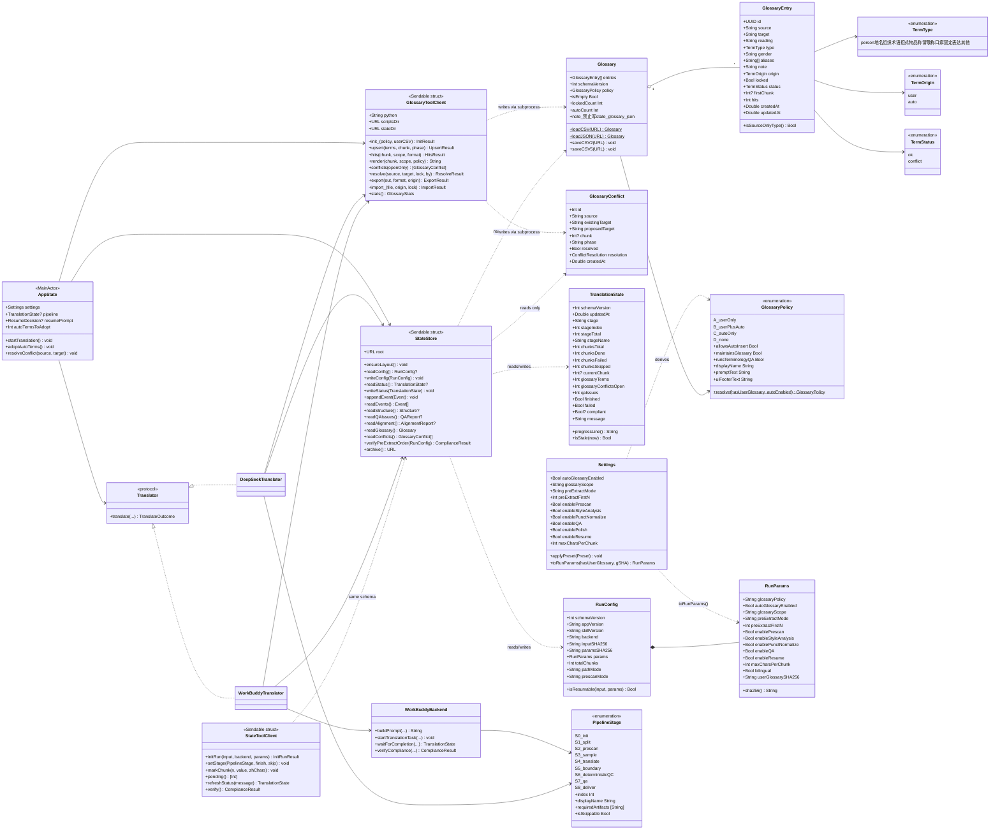
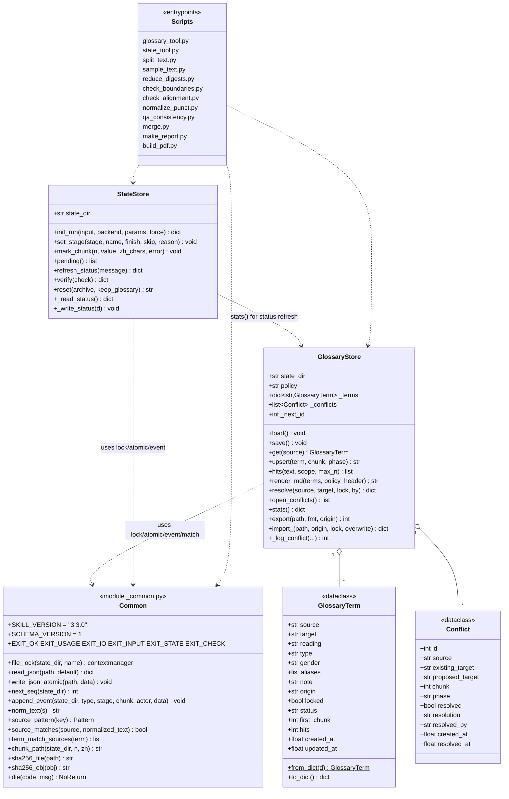
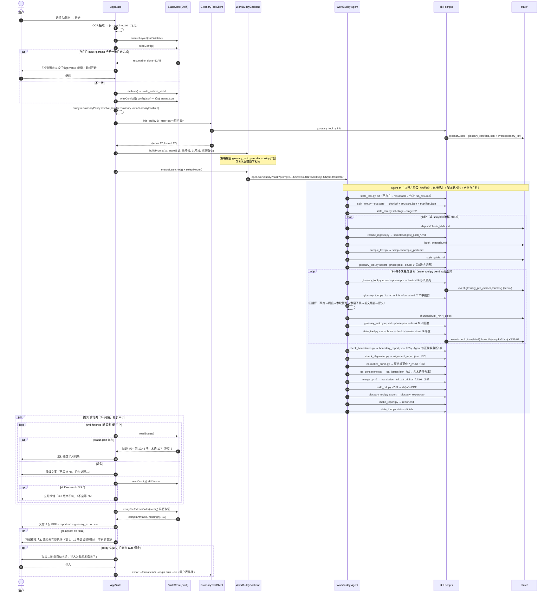
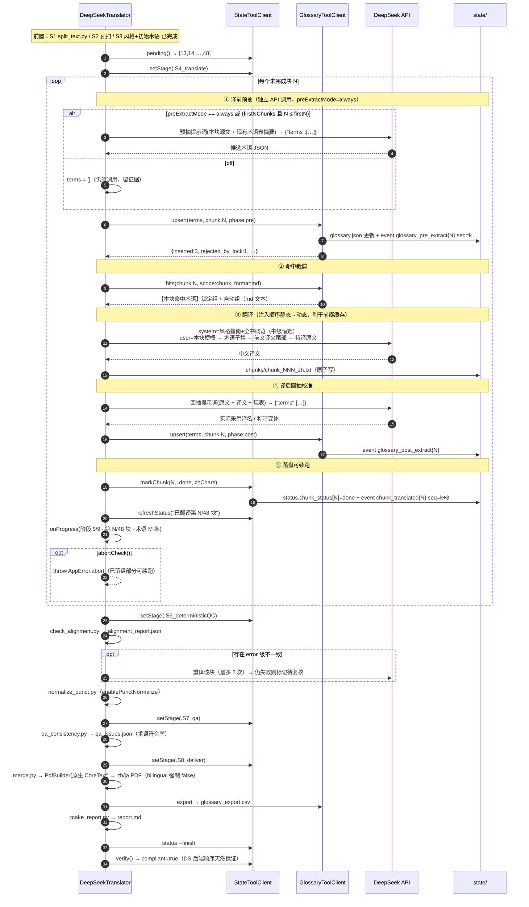
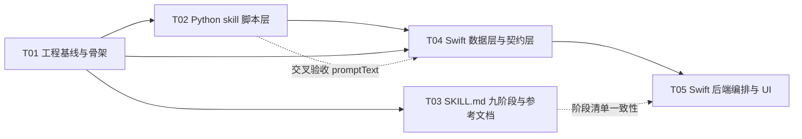

# JaPdfOcrTranslator v3.3 增量架构设计

| 项 | 值 |
|---|---|
| 文档版本 | v3.3 增量架构设计（DESIGN） |
| 基线 | v3.2 `JaPdfOcrTranslator-Swift`（Swift 6 + SwiftUI，macOS 26，SPM 可执行目标） |
| 目标目录 | `/Users/takimotouki/WorkBuddy/2026-07-26-16-53-28/JaPdfOcrTranslator-Swift-v33/` |
| 上游输入 | `docs/PRD-v3.3.md`（许清楚）、`wenyi-0.4.0` 参考实现 |
| 作者 | 高见远（架构师） |
| 范围 | P0 九条全做 · P1 九条全做（F33-16 简化版）· P2 五条不做 |

---

## 1. 实现方案总述

### 1.1 一句话架构

> 在 v3.2「Swift 壳 + Python skill」的既有骨架上，**插入一个双端共用的 `state/` 契约层**：
> 术语库的**语义**单点收敛到 `glossary_tool.py`，流程**状态**用扁平 JSON 双端各自实现但由 schema 锁定，
> 两个翻译后端（WorkBuddy Agent / DeepSeek 直连）退化为同一份 `state/` 协议的两种驱动方式。

```
┌──────────────────────── Swift App (macOS) ────────────────────────┐
│  AppState ──► OCR/抽取(沿用) ──► ja_combined.txt                   │
│      │                                                            │
│      ├─ StateStore(Swift)  ┐                                      │
│      ├─ GlossaryToolClient ┤ 都只操作 <outDir>/state/              │
│      │                     │                                      │
│      ├─► WorkBuddyTranslator ─deep link─► WorkBuddy Agent          │
│      │        └ 轮询 status.json / 事后校验 events.jsonl           │
│      └─► DeepSeekTranslator ─HTTP─► DeepSeek API                   │
└───────────────────────────────────────────────────────────────────┘
                       ▼ 同一个契约目录 ▼
┌──────────────────────── <outDir>/state/ ──────────────────────────┐
│ config.json  status.json  events.jsonl  structure.json            │
│ glossary.json  glossary_conflicts.json                            │
│ chunks/  digests/  samples/  .locks/                              │
│ style_guide.md  book_synopsis.md  alignment_report.json           │
│ qa_issues.json  report.md  glossary_export.csv                    │
└───────────────────────────────────────────────────────────────────┘
                       ▲ 同一套脚本 ▲
┌──── skill scripts (stdlib-only Python) ───────────────────────────┐
│ _common.py  glossary_tool.py  state_tool.py  split_text.py …      │
└───────────────────────────────────────────────────────────────────┘
```

### 1.2 关键技术选型与理由

| # | 决策 | 备选 | 选择理由 |
|---|---|---|---|
| D1 | **术语库主存 = JSON + `fcntl.flock` 文件锁** | SQLite | 见 §1.3 |
| D2 | **术语库语义单点在 `glossary_tool.py`；Swift 只读不写** | Swift 重写一份 upsert | 见 §1.4 |
| D3 | **`status.json`/`events.jsonl`/`config.json` 双端各自实现** | 全部走脚本 | 语义是"整份快照覆盖"和"追加一行"，无合并逻辑，漂移风险≈0；且 Swift 需在 python 缺失时仍能显示进度（降级路径） |
| D4 | **`state/` 就挂在 `<outDir>/state/`，不做 slug 子目录** | `<outDir>/state/<slug>/` | Agent 读 markdown 执行，路径每多一层就多一分写错概率；归属冲突用 `config.json.input_sha256` 判定 + 归档旧目录解决 |
| D5 | **`chunk` 编号全局唯一、三位补零、1-based** | 章节/段落二维坐标（wenyi 做法） | 我们没有 EPUB 目录锚点；一维编号让"事件 ↔ 文件 ↔ 进度"三者可直接 join |
| D6 | **`seq` 单调计数器作为事件排序主键，`ts` 仅作展示** | 只用 ts | F33-02 要判"①早于③"。同秒内多次调用时 float ts 可能相等甚至因时钟回拨倒挂；`seq` 由锁内自增，绝对可靠 |
| D7 | **DS 后端也调 `split_text.py` 切分** | 沿用 `TextSplitter.swift` | 两后端 chunk 边界必须逐字一致，否则跨后端续跑会错位；`structure.json` 也只需一处实现 |
| D8 | **零第三方 Python 依赖（除既有 reportlab）** | 引 `regex`/`pydantic` | 脚本跑在用户任意 `python3` 上，无法保证 pip 可用/联网；`unicodedata`（NFKC）与 `fcntl`（flock）都是 stdlib，已够用 |
| D9 | **Agent 不合规 = 事后取证，不阻断交付** | 阻断 / 自动重跑 | skill 无编排层，无法强制重试；6 小时的成本不能因为一条事件缺失而作废。标注 ⚠️ 并把证据写进报告 |
| D10 | **`glossary_tool.py` 不可用时 DS 后端拒绝启动** | Swift 降级实现 | 宁可明确失败，也不产生第二套 upsert 语义 |

### 1.3 为什么 JSON + 文件锁够用（回答 Q1）

| 维度 | 事实 | 结论 |
|---|---|---|
| **并发模型** | WB 后端：Agent 串行调脚本，同一时刻只有一个 python 进程；DS 后端：Swift `for` 循环 `await`，天然串行 | 不存在真并发写，锁只是**防御性**的 |
| **数据量** | 单本小说术语 ≤ 数千条；3000 条 × 约 200B ≈ 600KB | 全量读 + 全量写 < 10ms，48 块 × 3 次 = 144 次 ≈ 1.5s，可忽略 |
| **跨语言** | Python `json` / Swift `Codable` 均零依赖 | SQLite 需在 Swift 侧桥接 C API 或引 SPM 依赖，且 WAL 的 `-shm`/`-wal` 副文件会污染 state 目录（wenyi 为此写了 60 行快照代码，见 `store.load_terms_readonly`） |
| **可观测** | JSON 人可读、可 `git diff`、出问题能手改 | 用户报障时可直接让其贴 `glossary.json` |
| **真实竞态** | 用户在翻译过程中打开术语表编辑器 | **不冲突**：编辑器操作的是 `settings.glossaryPath` 指向的**用户 CSV**，与 `state/glossary.json` 是两个文件；只有"收编/裁决"两个动作会写 state，届时通过 `glossary_tool.py` 加锁写 |

**锁实现**：`<state>/.locks/glossary.lock`，`fcntl.flock(fd, LOCK_EX)`（Python）/ `flock(fd, LOCK_EX)`（Swift，Darwin 同一系统调用，跨进程互斥有效）。
**写实现**：同目录 `*.tmp` + `fsync` + `os.replace()`（Python）/ `FileManager.replaceItem`（Swift），保证断电不产生半截文件。

### 1.4 Swift 与 Python 如何共用 `glossary.json` 而不出现两套事实标准（核心）

按**写操作的语义复杂度**划分归属，而不是按语言划分：

| 文件 | 写语义复杂度 | 归属 | Swift 侧做法 |
|---|---|---|---|
| `glossary.json` | **高**（upsert 三态、locked 优先级、别名合并、NFKC+词边界匹配、first_chunk 归属） | **仅 `glossary_tool.py`** | 只读（`Codable`）用于 UI 展示；一切写走 `GlossaryToolClient` → 子进程 |
| `glossary_conflicts.json` | **高**（与 upsert 事务同体） | **仅 `glossary_tool.py`** | 只读 + `resolve` 子命令 |
| `status.json` | 低（整份快照覆盖） | 双端 | `StateStore.writeStatus()` |
| `events.jsonl` | 低（锁内 seq++ 后追加一行） | 双端 | `StateStore.appendEvent()` |
| `config.json` | 低（一次性写入，此后只读） | 双端 | `StateStore.initConfig()` |

**约束落地方式**：

1. Swift 侧**没有任何**写 `glossary.json` 的代码路径。代码评审红线：`Models/Glossary.swift` 中禁止出现 `write(to:` 指向 `glossary.json` 的语句（只允许写用户 CSV / 用户 JSON）。
2. 术语**命中裁剪**（NFKC 归一化 + 词边界规则 + `SOURCE_ONLY_TYPES` 例外）同样属"语义"，Swift 不重写，走 `glossary_tool.py hits --chunk N`。
3. **提示词块渲染**也走脚本（`glossary_tool.py render`），保证 WB 后端注入给 Agent 的块与 DS 后端注入给 API 的块**逐字相同**——这是 F33-03 符合率能跨后端比较的前提。
4. `schema_version` 双端硬校验：读到不认识的版本 → 抛错，不猜测。

> **代价与接受**：DS 后端每块 3 次子进程调用（pre-upsert / hits / post-upsert），约 40ms/次，48 块共 ~6s，相对一次 API 调用（数秒）完全可忽略。换来的是"冲突语义永不漂移"。

### 1.5 关于 `SkillRegistry.mergeSkillDirectory` 非破坏性覆盖的残留问题（明确结论）

**结论：v3.2 旧脚本残留无害，但必须修两个衍生缺陷。**

论证：

| 检查项 | 结论 |
|---|---|
| v3.3 脚本集合是否为 v3.2 的超集？ | **是**。v3.2 的 4 个脚本（`split_text/check_boundaries/merge/build_pdf`）在 v3.3 全部保留同名，merge 时被**内容覆盖**，不会出现"新旧两份并存" |
| 是否存在"孤儿脚本被误调用"？ | **否**。Agent 的唯一入口是 `SKILL.md`（已被覆盖为九阶段版），它不会提到不存在于 v3.3 清单里的脚本；`references/translation_guide.md` 同样被覆盖 |
| 是否存在"旧 SKILL.md 残留"？ | **否**。同名覆盖 |

**必须修的衍生缺陷：**

| # | 缺陷 | 现象 | 处置 |
|---|---|---|---|
| **B1** | `isSynced()` 用**双向**树签名比较（`treeSignature(source) == treeSignature(registry)`） | 只要 registry 目录多出任何一个非隐藏文件（用户手放、Agent 把产物误写进 skill 目录、其它工具生成），签名恒不等 → **每次启动都全量重 merge 13 个文件**，`skillInstalled` 形同虚设 | 改为**单向包含校验**：source 中每个文件在 registry 中存在且内容 SHA-256 相同即视为 synced，**忽略 registry 独有文件** |
| **B2** | 无法识别"应用是 v3.3 但 registry 里是 v3.2 残留 skill" | 若 `ensureLoaded` 因权限等原因静默失败，Agent 会按六步旧流程跑，产出无 `state/`，应用轮询 `status.json` 永远超时 6 小时 | 三重印记：① `SKILL.md` frontmatter 加 `version: 3.3.0`；② `_common.py` 内常量 `SKILL_VERSION = "3.3.0"`，`state_tool.py init` 把它写进 `config.json.skill_version`；③ Swift 在 `waitForCompletion` 首次读到 `config.json` 时校验版本，不符立即报错退出（而不是空等 6 小时） |
| **B3** | 孤儿文件无诊断 | 用户机器上脏文件不可见 | 新增只读诊断 `SkillRegistry.orphanFiles(_:) -> [String]`，写 warning 日志 + 设置页灰字显示，**不自动删除**（避免误删用户自定义 skill 资源） |

---

## 2. 完整文件清单

> 路径相对 `JaPdfOcrTranslator-Swift-v33/`。状态：🆕新增 / 🔧修改 / ♻️沿用（零改动）。
> **拷贝命令（T01 第一步）**：`rsync -a --exclude '.build/' --exclude 'build/' --exclude 'docs/' <v3.2>/ <v3.3>/` —— `--exclude 'docs/'` 保护已存在的 `docs/PRD-v3.3.md`。

### 2.1 工程与文档

| 路径 | 状态 | 职责 |
|---|:---:|---|
| `Package.swift` | ♻️ | SPM 清单；`.copy("Resources/skills/jp-txt2pdf-translator")` 整目录拷贝，新增脚本自动带上，**无需改动** |
| `README.md` | 🔧 | 更新版本号、九阶段说明、state 目录说明 |
| `docs/PRD-v3.3.md` | ♻️ | 产品需求（勿动） |
| `docs/DESIGN-v3.3.md` | 🆕 | 本文档 |
| `docs/class-diagram.mermaid` | 🆕 | §5 类图抽出 |
| `docs/sequence-diagram.mermaid` | 🆕 | §6 时序图抽出 |

### 2.2 Swift — Core

| 路径 | 状态 | 职责 |
|---|:---:|---|
| `Sources/JaPdfOcrTranslator/Core/FileLock.swift` | 🆕 | `flock(2)` 跨进程排他锁 + `withLock` 作用域包装 |
| `Core/StateStore.swift` | 🆕 | `state/` 目录的 Swift 侧读写单一入口（config/status/events/structure/qa/alignment 读；config/status/events 写） |
| `Core/GlossaryToolClient.swift` | 🆕 | `glossary_tool.py` 全部子命令的 Swift 类型化封装（子进程 + JSON 编解码） |
| `Core/SkillRegistry.swift` | 🔧 | `requiredScripts` 扩为 13 项；`isSynced` 改单向；`checkStatus` 列出缺失文件名；新增 `orphanFiles` |
| `Core/Paths.swift` | 🔧 | 新增 `stateDir(outDir:)`、`skillScriptsDir()`（优先 registry，回退 bundle）、`chunkFile(state:index:zh:)` |
| `Core/ProcessRunner.swift` | 🔧 | 新增 `runCapturing(exec:args:stdin:timeout:) -> (code:Int32, out:String, err:String)` |
| `Core/Errors.swift` | 🔧 | 新增 `case state(String)` / `case glossaryTool(String)` / `case skillVersion(String)` |
| `Core/OcrEngine.swift` `Core/TextExtractor.swift` `Core/PythonBootstrap.swift` `Core/Logger.swift` | ♻️ | OCR / 抽取 / venv / 日志，零改动 |

### 2.3 Swift — Models

| 路径 | 状态 | 职责 |
|---|:---:|---|
| `Models/Glossary.swift` | 🔧 | `Entry` 扩为 11 字段；主存 JSON；保留两栏 CSV 读写；`toPromptBlock()` 移除硬编码，改为按策略分组渲染 |
| `Models/GlossaryPolicy.swift` | 🆕 | A/B/C/D 决策矩阵枚举 + `resolve()` + `promptText` + 行为断言（`allowsAutoInsert` 等） |
| `Models/GlossaryConflict.swift` | 🆕 | `glossary_conflicts.json` 的 Codable 映射 + `resolution` 枚举 |
| `Models/TranslationState.swift` | 🆕 | `status.json` 的 Codable 映射 + 进度文案派生（`progressLine`） |
| `Models/RunConfig.swift` | 🆕 | `config.json` 的 Codable 映射 + `paramsSHA256()` 计算 + 续跑判定 |
| `Models/Settings.swift` | 🔧 | 新增 10 个设置项（PRD 8 项 + `preExtractMode` + `preExtractFirstN`）+ 三个预设 |
| `Models/ConfirmRequest.swift` | 🔧 | 增 `policySummary` / `pipelineSummary` 两行 |
| `Models/SkillInfo.swift` | ♻️ | — |

### 2.4 Swift — Translate / PDF / UI

| 路径 | 状态 | 职责 |
|---|:---:|---|
| `Translate/PipelineStage.swift` | 🆕 | S0–S8 阶段枚举（编号/中文名/必须产出清单/是否可跳过），**WB 与 DS 共用** |
| `Translate/WorkBuddyBackend.swift` | 🔧 | `buildPrompt()` 重写（注入 state 路径 / 策略段 / 九阶段 / 续跑指令）；`waitForOutputs()` → `waitForCompletion()` 轮询 `status.json`；新增 `verifyCompliance()` |
| `Translate/WorkBuddyTranslator.swift` | 🔧 | 编排：初始化 state → 起 deep link → 轮询 → 事后取证 → 汇总产物 |
| `Translate/DeepSeekTranslator.swift` | 🔧 **重写** | 应用内 S1–S8 阶段化编排；逐块 pre→hits→translate→post→落盘 |
| `Translate/TranslationPrompts.swift` | 🔧 | 删 `glossaryDirective` / `glossaryAbsentHint` / systemCore 里的「默认不要生成自动术语表」；新增阶段级提示词（梗概/概览/风格/预抽/回抽） |
| `Translate/Translator.swift` | 🔧 | `TranslateOutcome` 增 `reportPath` / `glossaryExportPath` / `compliant` / `stateDir` |
| `Translate/TextSplitter.swift` | ♻️ | 保留（不再用于主链路，主链路改调 `split_text.py`）；不删以免影响编译 |
| `Translate/DeepSeekClient.swift` | ♻️ | — |
| `PDF/PdfBuilder.swift` | ♻️ | 原生 CoreText 排版，零改动 |
| `UI/MainView.swift` | 🔧 | 进度卡片三行改造（阶段条 / 块进度 / 指标行）；术语状态徽标；「上次任务」提示条；日志按阶段折叠 |
| `UI/SettingsView.swift` | 🔧 | 新增「术语表策略」「翻译流水线」两个分组 + 快速/标准/精译预设 |
| `UI/GlossaryEditorView.swift` | 🔧 **重写** | 五列表格 + 真实行选中删除 + 搜索/筛选 + CSV 导入导出 + 冲突折叠面板 + 自动术语收编 + 底部策略说明 |
| `UI/Components.swift` | 🔧 | 新增 `StageBar` / `MetricChip` / `StatusBadge` / `SearchField` |
| `UI/ConfirmRunView.swift` | 🔧 | 展示策略与流水线摘要 |
| `App/AppState.swift` | 🔧 | 新增 `pipeline: TranslationState?`、`resumePrompt`、`autoTermsToAdopt`；工作目录复用与续跑判定；轮询驱动 UI |
| `App/JaPdfOcrApp.swift` `UI/AboutView.swift` `UI/WindowUtils.swift` | ♻️ | — |

### 2.5 skill — 文档与参考

| 路径 | 状态 | 职责 |
|---|:---:|---|
| `Sources/JaPdfOcrTranslator/Resources/skills/jp-txt2pdf-translator/SKILL.md` | 🔧 **重写** | frontmatter 加 `version: 3.3.0`；六步 → 九阶段；每阶段「输入 / 命令 / 必须产出 / 自检」四段式 |
| `…/references/translation_guide.md` | 🔧 | 补：术语类型定义、预抽/回抽判据、标点规范、段落对齐要求 |
| `…/references/glossary_policy.md` | 🆕 | A/B/C/D 四情形的 Agent 行为手册（含反例） |
| `…/references/style_guide_template.md` | 🆕 | `style_guide.md` 的六字段模板（体裁/语气/叙事人称/句式节奏/语域/对话风格） |

### 2.6 skill — 脚本（`…/scripts/`）

| 路径 | 状态 | 职责（纯确定性） | 第三方依赖 |
|---|:---:|---|---|
| `_common.py` | 🆕 | 共用底座：`SKILL_VERSION`、`file_lock()`、`write_json_atomic()`、`read_json()`、`append_event()`、`norm_text()`(NFKC+casefold)、`source_matches()`、`chunk_path()`、`die()`/退出码常量 | 无 |
| `glossary_tool.py` | 🆕 **核心** | 术语库唯一写入口，9 个子命令（§4） | 无 |
| `state_tool.py` | 🆕 | 状态目录管理，8 个子命令（§4.10） | 无 |
| `split_text.py` | 🔧 | 增：写 `structure.json`（章节边界/段落索引/字符数/句末完整性/块哈希）；`--out` 指向 state 目录 | 无 |
| `sample_text.py` | 🆕 | 按首/中/末抽样打包为 `state/samples/sample_pack.md`（S3 输入） | 无 |
| `reduce_digests.py` | 🆕 | 把 `digests/chunk_NNN.md` 分组打包为 `state/samples/digest_pack_KK.md`（S2 map-reduce，避免超长上下文） | 无 |
| `check_boundaries.py` | ♻️ | 跨块截断句检测（沿用，仅改默认路径为 `state/chunks`） | 无 |
| `check_alignment.py` | 🆕 | 段落数对齐、空译文、异常压缩比 → `alignment_report.json` | 无 |
| `normalize_punct.py` | 🆕 | 全角化 + 日式括号转换 + 代码围栏保护（原地改写 `chunk_NNN_zh.txt`） | 无 |
| `qa_consistency.py` | 🆕 | 日文残留 / 术语违例 / 占位符 / 数字 / 标点 → `qa_issues.json`，并输出术语符合率 | 无 |
| `merge.py` | ♻️ | 按序合并（沿用） | 无 |
| `make_report.py` | 🆕 | 汇总全部 state 产物 → `report.md` | 无 |
| `build_pdf.py` | ♻️ | reportlab 排版（沿用） | **reportlab**（既有） |

**`SkillRegistry.requiredScripts`（13 项，按依赖顺序）**：
```swift
static let requiredScripts = [
    "_common.py", "state_tool.py", "glossary_tool.py",
    "split_text.py", "sample_text.py", "reduce_digests.py",
    "check_boundaries.py", "check_alignment.py", "normalize_punct.py",
    "qa_consistency.py", "merge.py", "make_report.py", "build_pdf.py"
]
```

---

## 3. `state/` 目录规范（Swift ↔ Python 契约）

### 3.1 目录树

```
<outDir>/                                  ← 用户选的输出目录，同时是 deep link 的 cwd
├── ja_combined.txt                        OCR/抽取产物（沿用）
├── <stem>_zh.pdf  <stem>_ja.pdf  <stem>_bi.pdf
└── state/
    ├── config.json                 一次写入，此后只读。续跑判定依据
    ├── status.json                 高频覆盖写。UI 轮询源
    ├── events.jsonl                只追加。F33-02 唯一验收依据
    ├── structure.json              split_text.py 产出
    ├── manifest.json               v3.2 兼容（count/files），仍产出
    ├── glossary.json               术语库主存
    ├── glossary_conflicts.json     冲突表
    ├── glossary_export.csv         S8 导出（五列）
    ├── style_guide.md              S3
    ├── book_synopsis.md            S2
    ├── alignment_report.json       S6
    ├── qa_issues.json              S7
    ├── boundary_report.json        S5（沿用 check_boundaries.py）
    ├── report.md                   S8
    ├── translation_full.txt        S8
    ├── original_full.txt           S8
    ├── chunks/
    │   ├── chunk_001.txt           日文源块
    │   └── chunk_001_zh.txt        中文译块
    ├── digests/
    │   └── chunk_001.md            ≤200 字中文梗概
    ├── samples/
    │   ├── sample_pack.md          S3 抽样包
    │   └── digest_pack_01.md       S2 归并包
    └── .locks/
        ├── glossary.lock
        ├── state.lock
        └── seq                     事件序号计数器（纯文本整数）
```

### 3.2 `config.json`

| 字段 | 类型 | 必填 | 说明 |
|---|---|:---:|---|
| `schema_version` | int | ✅ | 固定 `1`。读到 >1 立即报错 |
| `created_at` / `updated_at` | float | ✅ | epoch 秒 |
| `app_version` | string | ✅ | `"3.3.0"` |
| `skill_version` | string | ✅ | 由 `_common.SKILL_VERSION` 写入。**B2 版本印记** |
| `backend` | string | ✅ | `"workbuddy"` \| `"deepseek"` |
| `input_path` | string | ✅ | 日文 txt 绝对路径 |
| `input_sha256` | string(64) | ✅ | 输入文件内容哈希，续跑判定 |
| `params_sha256` | string(64) | ✅ | `params` 对象规范化 JSON 的哈希，续跑判定 |
| `params` | object | ✅ | 见下表 |
| `total_chunks` | int | ✅ | S1 后回填；init 时为 `0` |
| `path_mode` | string | ✅ | `"full"`（九阶段）\| `"simple"`（≤2 块：跳 S2，S3 并入 S4） |
| `prescan_mode` | string | ✅ | `"full"` \| `"sampled"`（>60 块）\| `"off"` |
| `prescan_sample_indices` | int[] | ✅ | `sampled` 时的 30 个均匀抽样块号，否则 `[]` |
| `stages` | string[] | ✅ | 本次实际要执行的阶段号数组，如 `["S0","S1","S3","S4","S5","S6","S8"]` |

`params` 子对象（**`params_sha256` 的计算范围**）：

| 字段 | 类型 | 默认 | 对应设置项 |
|---|---|---|---|
| `glossary_policy` | string | `"B"`/`"C"` | 派生自 `hasUserGlossary × autoGlossaryEnabled` |
| `auto_glossary_enabled` | bool | `true` | `autoGlossaryEnabled` |
| `glossary_scope` | string | `"chunk"` | `glossaryScope`（`chunk`\|`full`） |
| `pre_extract_mode` | string | `"always"` | `preExtractMode`（`always`\|`firstNChunks`\|`off`） |
| `pre_extract_first_n` | int | `10` | `preExtractFirstN` |
| `enable_prescan` | bool | `true` | `enablePrescan` |
| `enable_style_analysis` | bool | `true` | `enableStyleAnalysis` |
| `enable_punct_normalize` | bool | `true` | `enablePunctNormalize` |
| `enable_qa` | bool | `true` | `enableQA` |
| `enable_polish` | bool | `false` | `enablePolish`（P2，恒为 false） |
| `enable_resume` | bool | `true` | `enableResume` |
| `max_chars_per_chunk` | int | `4000` | `maxCharsPerChunk` |
| `max_chars_per_paragraph` | int | `8000` | 固定 |
| `bilingual` | bool | `true`/`false` | DS 后端强制 `false` |
| `user_glossary_sha256` | string | `""` | 用户 CSV 内容哈希；用户改表则参数哈希变化 → 不可续跑 |

**续跑判定**（Q5 落地）：
```
resumable = enable_resume
          ∧ config.json 存在且 schema_version == 1
          ∧ config.input_sha256  == sha256(当前输入 txt)
          ∧ config.params_sha256 == sha256(当前 params 规范化 JSON)
          ∧ status.finished == false
```
任一不满足 → Swift 弹三选：`继续`（仅 resumable 时可用）/ `归档旧状态并重新开始`（`state/` → `state_archive_<yyyyMMddHHmmss>/`）/ `取消`。

### 3.3 `status.json`

| 字段 | 类型 | 说明 |
|---|---|---|
| `schema_version` | int | `1` |
| `updated_at` | float | epoch 秒。UI 用它判断"是否卡死" |
| `stage` | string | `"S4"` |
| `stage_index` | int | `4`（0–8；`S0`→0） |
| `stage_total` | int | `9` |
| `stage_name` | string | `"逐块翻译"` |
| `chunks_total` | int | 总块数 |
| `chunks_done` | int | 已完成（含 skipped） |
| `chunks_failed` | int | 失败块数 |
| `chunks_skipped` | int | 续跑跳过 |
| `current_chunk` | int? | 正在处理的块号，空闲为 `null` |
| `glossary_terms` | int | 术语总条数 |
| `glossary_locked` | int | 锁定条数 |
| `glossary_conflicts_open` | int | 未决冲突数 |
| `qa_issues` | int | QA 问题总数 |
| `alignment_issues` | int | 对齐问题数（error 级） |
| `finished` | bool | 全流程结束 |
| `failed` | bool | 致命失败 |
| `compliant` | bool? | 事后合规校验结果；未校验为 `null` |
| `message` | string | 一句话人类可读状态 |
| `chunk_status` | object | `{"1":"done","13":"running", …}`；值域 `pending\|running\|done\|failed\|skipped` |
| `artifacts` | object | `{"zh_pdf":"","ja_pdf":"","bi_pdf":"","report":"","glossary_csv":""}` 绝对路径，未产出为 `""` |

**UI 文案派生**（F33-09）：
`阶段 {stage_index+1}/9 · {stage_name} ｜ 第 {chunks_done}/{chunks_total} 块 ｜ 术语 {glossary_terms} 条 · 冲突 {glossary_conflicts_open} · QA {qa_issues}`
`status.json` 缺失或 `updated_at` 超过 300s 未更新 → 降级为 v3.2 文案 `已等待 {n}s，仍在处理…`。

### 3.4 `events.jsonl`

每行一个 JSON 对象，字段固定：

| 字段 | 类型 | 说明 |
|---|---|---|
| `seq` | int | **单调自增主键**，来源 `<state>/.locks/seq`，锁内 `read → +1 → write` |
| `ts` | float | epoch 秒，仅展示 |
| `type` | string | 见下方枚举 |
| `stage` | string? | `"S4"` 或 `null` |
| `chunk` | int? | 块号或 `null` |
| `actor` | string | `"script"` \| `"swift"` \| `"agent"` |
| `data` | object | 类型相关载荷 |

**事件类型枚举（完整）**

| type | 写入者 | chunk | `data` 字段 |
|---|---|:---:|---|
| `run_init` | state_tool init | – | `input_sha256, params_sha256, path_mode, prescan_mode, backend` |
| `run_resume` | state_tool init | – | `done, pending` |
| `stage_started` | state_tool set-stage | – | `stage, name` |
| `stage_finished` | state_tool set-stage | – | `stage, name, artifacts[]` |
| `stage_skipped` | state_tool set-stage --skip | – | `stage, reason` |
| `split_done` | split_text.py | – | `chunks, total_chars` |
| `digest_written` | state_tool event | N | `chars` |
| `synopsis_written` | state_tool event | – | `chars, source` (`full`\|`sampled`) |
| `style_guide_written` | state_tool event | – | `chars` |
| `glossary_init` | glossary_tool init | – | `policy, user_terms` |
| **`glossary_pre_extract`** | glossary_tool upsert --phase pre | **N** | `inserted, unchanged, conflict, rejected_by_lock, rejected_by_policy, invalid` |
| `glossary_hits` | glossary_tool hits | N | `count, scope` |
| **`chunk_translated`** | state_tool mark-chunk done | **N** | `src_chars, zh_chars` |
| **`glossary_post_extract`** | glossary_tool upsert --phase post | **N** | 同 pre |
| `chunk_skipped` | state_tool mark-chunk skipped | N | `reason`（`resume`\|`policy`） |
| `chunk_failed` | state_tool mark-chunk failed | N | `error` |
| `boundary_fixed` | state_tool event | N | `pairs` |
| `alignment_checked` | check_alignment.py | – | `checked, errors, warns` |
| `punct_normalized` | normalize_punct.py | – | `files, replacements` |
| `qa_done` | qa_consistency.py | – | `issues, by_kind{}, term_rate` |
| `glossary_resolved` | glossary_tool resolve | – | `source, target, by` |
| `glossary_imported` | glossary_tool import | – | `added, updated, origin` |
| `merged` | merge.py | – | `out, chars` |
| `pdf_built` | state_tool event | – | `path, kind`（`zh`\|`ja`\|`bi`） |
| `report_written` | make_report.py | – | `path` |
| `run_finished` | state_tool status --finish | – | `ok, compliant` |
| `run_failed` | state_tool status --fail | – | `error` |

**F33-02 验收算法（`state_tool.py verify --check pre-extract-order` 的实现规范）**
```
required = { N : 1 ≤ N ≤ total_chunks
                 ∧ chunk_status[N] == "done"
                 ∧ chunk_status[N] != "skipped"
                 ∧ (pre_extract_mode == "always"
                    ∨ (pre_extract_mode == "firstNChunks" ∧ N ≤ pre_extract_first_n)) }
for N in required:
    pre = min{ e.seq | e.type == "glossary_pre_extract" ∧ e.chunk == N }
    tr  = min{ e.seq | e.type == "chunk_translated"     ∧ e.chunk == N }
    fail if pre 不存在 or tr 不存在 or pre >= tr
compliant = (无 fail)
pre_extract_mode == "off" → compliant = true，但 report 标注「术语预抽已降级为 off」
```

### 3.5 `structure.json`（split_text.py 产出）

```jsonc
{
  "schema_version": 1,
  "generated_at": 1754000000.0,
  "source_path": "/abs/ja_combined.txt",
  "total_chars": 184320,
  "chunk_count": 48,
  "target": 4000,
  "maxp": 8000,
  "chapters": [
    { "index": 1, "title": "第一章 出会い", "start_chunk": 1, "start_paragraph": 0 }
  ],
  "chunks": [
    {
      "index": 1,
      "file": "chunks/chunk_001.txt",
      "chars": 3980,
      "paragraphs": 12,
      "chapter_index": 1,
      "is_chapter_head": true,
      "starts_mid_sentence": false,   // 首字符前是否缺句首（承接上块）
      "ends_mid_sentence": true,      // 末字符是否非句末符 → 交给 check_boundaries
      "sha256": "…64hex…"
    }
  ]
}
```

### 3.6 `glossary.json`

```jsonc
{
  "schema_version": 1,
  "updated_at": 1754000123.4,
  "policy": "B",
  "terms": [
    {
      "source": "御堂 静",          // string, 唯一主键（原样保存，匹配时才归一化）
      "target": "御堂静",           // string, 中文译名
      "reading": "みどう しずか",   // string, 可空
      "type": "人物",               // enum 见下
      "gender": "女",               // string, 可空；仅 type=人物 有意义
      "aliases": ["静ちゃん"],       // string[], 同一 source 的其它原文写法
      "note": "女主角",             // string, 可空
      "origin": "user",             // enum: user | auto
      "locked": true,               // bool; origin=user 时恒 true
      "status": "ok",               // enum: ok | conflict
      "first_chunk": 1,             // int|null, 首次出现块号
      "hits": 42,                   // int, 累计命中次数（qa_consistency 回填）
      "created_at": 1754000000.0,
      "updated_at": 1754000100.0
    }
  ]
}
```

| 字段 | 约束 |
|---|---|
| `terms` | **数组**（非字典），稳定排序 `(type, source)`；`source` 唯一由工具保证 |
| `type` 值域 | `人物 \| 地名 \| 组织 \| 术语 \| 招式 \| 物品 \| 称谓 \| 敬称 \| 口癖 \| 固定表达 \| 其他`；未知值一律归 `其他` |
| `SOURCE_ONLY_TYPES` | `{称谓, 敬称, 口癖, 固定表达}` —— 这四类**只按 `source` 匹配，忽略 `aliases`**（照搬 wenyi：避免裸名 alias 把带语气的派生译法注入普通称呼） |
| `origin=user` | ⇒ `locked=true`；反之 `locked=true` 不必然 `origin=user`（用户裁决可锁定一条 auto 词条） |
| `status=conflict` | 表示该 source 存在未决冲突；`target` 仍是**现值**（不被候选覆盖） |

### 3.7 `glossary_conflicts.json`

```jsonc
{
  "schema_version": 1,
  "next_id": 4,
  "conflicts": [
    {
      "id": 1,
      "source": "御堂 静",
      "existing_target": "御堂静",
      "proposed_target": "米堂静",
      "chunk": 17,
      "phase": "post",                  // pre | post | import | manual
      "resolved": true,
      "resolution": "rejected_by_lock", // "" | rejected_by_lock | resolved_by_user | resolved_by_agent | superseded
      "resolved_by": "system",          // system | user | agent
      "created_at": 1754000200.0,
      "resolved_at": 1754000200.0
    }
  ]
}
```

- `resolution == ""` 且 `resolved == false` → **待裁决**，计入 `glossary_conflicts_open`。
- `rejected_by_lock` 在**创建时即 resolved=true**（锁定词条冲突不进裁决队列，只留证据，符合 F33-04）。

### 3.8 `alignment_report.json`

```jsonc
{
  "schema_version": 1, "generated_at": 1754000000.0,
  "checked": 48,
  "ratio_range": [0.55, 1.70],
  "summary": { "error": 2, "warn": 1 },
  "issues": [
    { "chunk": 13, "kind": "paragraph_count_mismatch",
      "src_paragraphs": 14, "zh_paragraphs": 11, "delta": -3, "severity": "error" },
    { "chunk": 22, "kind": "ratio_out_of_range",
      "src_chars": 3980, "zh_chars": 1230, "ratio": 0.31, "severity": "warn" },
    { "chunk": 30, "kind": "empty_translation", "severity": "error" },
    { "chunk": 31, "kind": "missing_file", "path": "chunks/chunk_031_zh.txt", "severity": "error" }
  ]
}
```
`kind` 值域：`paragraph_count_mismatch \| ratio_out_of_range \| empty_translation \| missing_file`
`severity` 值域：`error \| warn`

### 3.9 `qa_issues.json`

```jsonc
{
  "schema_version": 1, "generated_at": 1754000000.0,
  "summary": {
    "total": 13,
    "by_kind": { "japanese_residue": 3, "terminology": 2, "placeholder": 0,
                 "number": 1, "punctuation": 5, "paragraph": 2, "suggestion": 0 },
    "by_severity": { "error": 6, "warn": 5, "info": 2 },
    "terminology_expected": 412,     // 术语命中的应出现次数（分母）
    "terminology_violations": 6,     // 违例次数（分子）
    "terminology_rate": 0.9854       // 1 - 违例/应出现；F33-03 要求 ≥ 0.98
  },
  "issues": [
    { "id": 1, "kind": "terminology", "severity": "error",
      "chunk": 17, "line": 42,
      "source": "御堂 静", "expected": "御堂静", "found": "米堂静",
      "excerpt": "…米堂静轻声说…", "suggestion": "改为「御堂静」" }
  ]
}
```
`kind` 值域：`japanese_residue \| terminology \| placeholder \| number \| punctuation \| paragraph \| empty \| suggestion`
（`suggestion` 专供情形 A 的「疑似应入表但未入表」只读建议，`severity=info`，见 Q2 决策）

---

## 4. `glossary_tool.py` CLI 契约（v3.3 的心脏）

### 4.0 通用约定

| 项 | 约定 |
|---|---|
| 调用形式 | `$PY $SKILL/glossary_tool.py <subcommand> --state <state_dir> [options]` |
| `--state` | **所有子命令必填**，指向 `<outDir>/state`。工具自建 `.locks/` |
| stdout | 除 `render` / `hits --format md` / `export` 外，**一律输出单个 JSON 对象**（无多余打印） |
| stderr | 人类可读的诊断信息；即使成功也可能有 warning |
| 编码 | 全链路 UTF-8；输入 JSON 允许 BOM |
| 锁 | 所有会写 `glossary*.json` 的子命令在 `.locks/glossary.lock` 上持 `LOCK_EX` 全程 |
| 原子性 | 单次子命令 = 一个事务：先全量读入内存 → 计算 → 一次性原子写回 glossary + conflicts + event。任一步异常则不落盘 |

**退出码**

| 码 | 含义 | 场景 |
|:---:|---|---|
| `0` | 成功（**包含"部分条目被拒绝"**，详情在 stdout JSON） | 正常 |
| `1` | 用法/参数错误 | 缺参、互斥参数同时给出 |
| `2` | IO / 锁错误 | 目录不可写、锁超时（30s） |
| `3` | 输入 JSON 畸形 | stdin 非法 JSON、`terms` 非数组 |
| `4` | 状态未初始化 / 目标不存在 | `glossary.json` 缺失、`resolve` 的 source 不存在 |
| `5` | 检查未通过（仅 `conflicts --fail-if-open`） | 存在未决冲突 |

> **设计要点**：只有真正的错误才非零退出。"policy A 下试图新增 3 条"是**业务结果**不是错误，退 0 并在 JSON 里报 `rejected_by_policy: 3`——否则 Agent 会误以为脚本坏了而中断整个流程。

---

### 4.1 `init` — 初始化术语库

```bash
glossary_tool.py init --state <dir> --policy {A|B|C|D}
                      [--user-csv <path> | --user-json <path>]
                      [--force]
```

| 参数 | 必填 | 说明 |
|---|:---:|---|
| `--policy` | ✅ | 决策矩阵情形。A/B 必须同时给 `--user-csv`/`--user-json` 且解析后条目 ≥ 1，否则退 1 |
| `--user-csv` | – | 用户术语表 CSV。**兼容两栏**（`日语,中文`，跳表头）与五栏（`日语,中文,类型,来源,备注`）。缺列用默认值填充 |
| `--user-json` | – | 用户术语表 JSON（`{"terms":[…]}`），字段同 §3.6 |
| `--force` | – | 已存在 `glossary.json` 时强制重建（丢弃现有内容） |

**副作用**：创建 `glossary.json`（用户词条 `origin=user, locked=true, status=ok, first_chunk=null`）与空 `glossary_conflicts.json`；写事件 `glossary_init`。
**幂等**：未给 `--force` 且 `glossary.json` 已存在 → 退 0，输出现状统计，**不覆盖**（这是续跑的关键）。

**stdout**
```json
{"ok":true,"created":true,"policy":"B","terms":12,"locked":12,"auto":0,
 "path":"/abs/state/glossary.json"}
```

---

### 4.2 `upsert` — 写入术语（唯一写路径）⭐

```bash
glossary_tool.py upsert --state <dir> [--chunk N] [--phase {pre|post}]
                        [--stdin | --file <path>]
                        [--default-type 术语]
```

| 参数 | 必填 | 说明 |
|---|:---:|---|
| `--chunk N` | 建议 | 块号。写入 `first_chunk` 与事件的 `chunk` 字段。`--phase` 存在时**必填** |
| `--phase` | – | `pre`=译前预抽 → 事件 `glossary_pre_extract`；`post`=译后回抽 → `glossary_post_extract`；不给 → `glossary_upsert` |
| `--stdin` / `--file` | ✅（二选一） | 术语数组来源 |

**stdin/`--file` 格式**
```json
{"terms":[
  {"source":"御堂 静","target":"御堂静","reading":"みどう しずか","type":"人物",
   "gender":"女","aliases":["静ちゃん"],"note":"女主角"}
]}
```
除 `source`/`target` 外全部可选。`type` 缺省取 `--default-type`（默认 `术语`）。
**空数组合法且必须支持**：`{"terms":[]}` —— 这是 F33-02 的「即使无新词也要留证据」调用。

**upsert 判定表（唯一权威语义）**

| 条件 | 结果 | 动作 |
|---|---|---|
| `source` 或 `target` 为空 | `invalid` | 丢弃 |
| policy ∈ {A, D} 且 source **不在**库中 | `rejected_by_policy` | 丢弃，不记冲突 |
| policy == D | `rejected_by_policy` | 全部丢弃（D 不维护术语表） |
| source 不在库中（policy B/C） | `inserted` | 插入，`origin=auto, locked=false, status=ok, first_chunk=--chunk` |
| 已存在 且 `locked=true` 且 `target` 相同 | `unchanged` | 合并 `aliases`（并集）、补空 `reading`/`gender`/`note`，**不动 `target`** |
| 已存在 且 `locked=true` 且 `target` 不同 | `rejected_by_lock` | **丢弃候选**；conflicts 追加一条 `resolution="rejected_by_lock", resolved=true`；**不改 `status`** |
| 已存在 且 `locked=false` 且 `target` 相同 | `unchanged` | 同上合并 |
| 已存在 且 `locked=false` 且 `target` 不同 | `conflict` | **保留现值**；`status="conflict"`；conflicts 追加一条 `resolution="", resolved=false` |

> `aliases` 合并规则：`sorted(set(existing) ∪ set(incoming))`，并剔除等于 `source` 的项。
> `first_chunk` 一旦写入**永不更新**（首次出现即定格）。

**stdout**
```json
{"ok":true,"chunk":13,"phase":"pre",
 "summary":{"inserted":3,"unchanged":5,"conflict":1,
            "rejected_by_lock":2,"rejected_by_policy":0,"invalid":0},
 "inserted":[{"source":"氷室","target":"冰室"}],
 "conflicts":[{"id":7,"source":"白鷺","existing_target":"白鹭","proposed_target":"白鹭鸶"}],
 "rejected_by_lock":[{"source":"御堂 静","locked_target":"御堂静","proposed_target":"米堂静"}],
 "totals":{"terms":140,"locked":12,"open_conflicts":3}}
```

**事件**（`data` 即上面的 `summary` + `hit`）：
`{"seq":88,"ts":…,"type":"glossary_pre_extract","stage":"S4","chunk":13,"actor":"agent","data":{…}}`

---

### 4.3 `hits` — 命中裁剪 ⭐

```bash
glossary_tool.py hits --state <dir>
                      (--chunk N | --text-file <path> | --stdin-text)
                      [--scope {chunk|full}] [--format {json|md|csv}]
                      [--max 400] [--no-event]
```

| 参数 | 说明 |
|---|---|
| `--chunk N` | 读 `<state>/chunks/chunk_NNN.txt` 作为匹配文本 |
| `--text-file` / `--stdin-text` | 直接给文本（DS 后端 / 边界修复时用） |
| `--scope full` | 忽略匹配，返回全表（对应 `settings.glossaryScope=full`） |
| `--max N` | 超出上限时按 `locked 优先 → hits 降序 → first_chunk 升序` 截断，并在结果里报 `truncated:true` |
| `--no-event` | 不写 `glossary_hits` 事件（避免 DS 后端刷屏） |

**匹配算法（照搬 wenyi `store.py`，必须逐条实现）**
1. `norm(s) = unicodedata.normalize("NFKC", s).casefold()`
2. 候选键：`type ∈ SOURCE_ONLY_TYPES` → 仅 `[source]`；否则 `[source, *aliases]`
3. 键为纯 ASCII → 正则 `(?<![a-z0-9_])<esc>(?![a-z0-9_])`
4. 键全为拉丁/希腊/西里尔字母 → 首尾按 `isalnum()` 决定加 `(?<!\w)` / `(?!\w)`
5. 其它（CJK 等连续书写） → 归一化后**子串匹配**
6. 任一键命中即该词条命中

**stdout（`--format json`）**
```json
{"ok":true,"chunk":13,"scope":"chunk","count":9,"truncated":false,
 "terms":[{"source":"御堂 静","target":"御堂静","type":"人物","locked":true,
           "aliases":["静ちゃん"],"note":"女主角","status":"ok"}]}
```
**stdout（`--format md`）** —— 直接可注入提示词：
```
【本块命中术语（必须遵守）】
■ 锁定词条（用户提供，逐字执行，不得改写）
- 御堂 静 → 御堂静（人物，女，读音:みどう しずか） [别名: 静ちゃん] ※女主角
■ 自动词条（软件维护，如需修正请记冲突，勿直接改译）
- 氷室 → 冰室（地名）
```
无命中时输出 `【本块命中术语】（暂无）`。

---

### 4.4 `render` — 渲染完整提示词块

```bash
glossary_tool.py render --state <dir> [--chunk N] [--scope {chunk|full}]
                        [--policy] [--max 400]
```
= `hits --format md` 的结果，前面拼上策略段（`--policy` 时，文案见 §7.2）。
**这是 WB 与 DS 两后端注入术语约束的唯一函数**，保证两后端提示词逐字相同。
stdout = 纯文本（非 JSON），退 0。

---

### 4.5 `conflicts` — 冲突查询

```bash
glossary_tool.py conflicts --state <dir> [--open | --all] [--source <s>]
                           [--format {json|md}] [--fail-if-open]
```
**stdout（json）**
```json
{"ok":true,"open":2,"total":5,
 "items":[{"id":7,"source":"白鷺","existing_target":"白鹭","proposed_target":"白鹭鸶",
           "chunk":22,"phase":"post","resolved":false,"resolution":"",
           "created_at":1754000300.0}]}
```
`--fail-if-open` 且 `open > 0` → 退 **5**（供 S7 自检使用）。

---

### 4.6 `resolve` — 冲突裁决（F33-16）

```bash
glossary_tool.py resolve --state <dir> --source <s>
                         (--target <t> | --take {existing|proposed} [--conflict-id ID])
                         [--lock] [--by {user|agent}]
```
| 参数 | 说明 |
|---|---|
| `--target` | 直接指定最终译名（手动填写） |
| `--take existing\|proposed` | 采用现值 / 采用候选值（简化版 UI 的两个按钮） |
| `--conflict-id` | `--take proposed` 时指定取哪条候选；缺省取该 source **最新**的未决冲突 |
| `--lock` | 裁决后锁定该词条（`locked=true`），后续自动流程不得再改 |
| `--by` | 记入 `resolved_by`，默认 `user` |

**副作用**：`terms[source].target = 最终值`、`status="ok"`、`updated_at` 刷新；该 source 全部未决冲突 `resolved=true, resolution="resolved_by_<by>"`；事件 `glossary_resolved`。
source 不存在 → 退 **4**。
**stdout**：`{"ok":true,"source":"白鷺","target":"白鹭","locked":false,"resolved_conflicts":2,"open_conflicts":1}`

---

### 4.7 `export` — 导出

```bash
glossary_tool.py export --state <dir> --out <path>
                        [--format {csv2|csv5|json}] [--origin {all|auto|user}]
                        [--only-ok]
```
| format | 内容 |
|---|---|
| `csv2` | `日语,中文` 两栏（**v3.2 向后兼容**，可直接作为用户术语表） |
| `csv5` | `日语,中文,类型,来源,备注`（v3.3 编辑器格式，`来源`列值为 `用户`/`自动`） |
| `json` | 完整 §3.6 结构 |

`--origin auto` 用于 F33-15「导入本次自动术语（N 条）」。CSV 写出时字段含 `,` 或 `"` 一律双引号包裹并转义 `""`。
**stdout**：`{"ok":true,"out":"/abs/state/glossary_export.csv","format":"csv5","rows":137}`

---

### 4.8 `import` — 导入外部术语

```bash
glossary_tool.py import --state <dir> --file <csv|json>
                        [--origin {user|auto}] [--lock] [--overwrite]
```
- `--origin user --lock`：把编辑器里的用户表推进正在跑的 state（覆盖同 source 的 auto 词条并锁定）。
- 不给 `--overwrite` 时遵循 §4.2 的 upsert 判定表；给了则**强制覆盖 target**（仅 `--origin user` 允许，用于用户显式操作）。
- 事件 `glossary_imported`。
**stdout**：`{"ok":true,"added":8,"updated":3,"skipped":1,"origin":"user"}`

---

### 4.9 `stats` — 统计

```bash
glossary_tool.py stats --state <dir> [--format {json|md}]
```
```json
{"ok":true,"terms":137,"locked":12,"auto":125,"open_conflicts":2,
 "by_type":{"人物":40,"地名":18,"术语":52,"称谓":15,"固定表达":12},
 "by_status":{"ok":135,"conflict":2},
 "policy":"B","updated_at":1754000400.0}
```
供 `state_tool.py status --refresh` 与 `make_report.py` 调用。

---

### 4.10 `state_tool.py` CLI 契约（附）

| 子命令 | 用法 | 副作用 / 输出 |
|---|---|---|
| `init` | `--state <dir> --input <txt> --backend {workbuddy\|deepseek} --params-json <json或@file> [--force]` | 写 `config.json`（含 `input_sha256`/`params_sha256`/`skill_version`/`path_mode`/`prescan_mode`）+ `status.json` 骨架；已存在且哈希一致 → 输出 `{"resumable":true,"done":12,"pending":36}` 并写 `run_resume`；不一致 → 退 **4** 并输出 `{"resumable":false,"reason":"input_changed"}` |
| `set-stage` | `--state <dir> --stage S4 [--name 逐块翻译] [--finish] [--skip --reason ...]` | 更新 `status.stage*`；写 `stage_started`/`stage_finished`/`stage_skipped` |
| `mark-chunk` | `--state <dir> --chunk N --value {done\|failed\|skipped\|running} [--zh-chars K] [--error msg] [--reason r]` | 更新 `status.chunk_status[N]` 与计数；`done`→事件 `chunk_translated`；`skipped`→`chunk_skipped`；`failed`→`chunk_failed` |
| `pending` | `--state <dir> [--format {json\|lines}]` | `{"pending":[13,14,…],"done":12,"total":48}`；`lines` 格式每行一个块号，便于 shell 循环 |
| `status` | `--state <dir> [--refresh] [--message m] [--finish] [--fail --error e] [--format {json\|md}]` | `--refresh` 会调 `glossary_tool stats` + 读 `qa_issues.json`/`alignment_report.json` 回填指标 |
| `event` | `--state <dir> --type <t> [--chunk N] [--stage S] [--kv k=v]… [--json '{…}']` | 追加一条事件（Agent 手工补事件用） |
| `verify` | `--state <dir> [--check {all\|pre-extract-order\|stage-artifacts\|chunk-complete}] [--format json]` | 合规校验；不通过退 **5**；输出 `{"compliant":false,"checks":{…},"missing_pre_extract":[7,19]}`；同时把 `compliant` 回写 `status.json` |
| `reset` | `--state <dir> [--archive] [--keep-glossary]` | `--archive` 把 `state/` 整体改名为 `state_archive_<ts>/` 后重建；`--keep-glossary` 保留术语库 |

---

## 5. 数据结构与接口（类图）

### 5.1 Swift 侧



### 5.2 Python 侧



---

## 6. 程序调用流程（时序图）

### 6.1 WorkBuddy 后端完整链路



### 6.2 DeepSeek 后端逐块翻译内循环（F33-02 硬约束）



---

## 7. 术语表决策矩阵的代码级落地

### 7.1 `GlossaryPolicy` 推导

```swift
/// A/B/C/D 四情形（PRD §5）。Sendable + Codable，跨 actor 安全。
enum GlossaryPolicy: String, Codable, Sendable, CaseIterable {
    case userOnly     = "A"   // 有用户表 + 关自动
    case userPlusAuto = "B"   // 有用户表 + 开自动（默认路径之一）
    case autoOnly     = "C"   // 无用户表 + 开自动（默认路径之一）
    case none         = "D"   // 无用户表 + 关自动（降级逃生口）

    /// 唯一推导入口。全工程禁止在别处用 if/else 拼这四种情形。
    static func resolve(hasUserGlossary: Bool, autoGlossaryEnabled: Bool) -> GlossaryPolicy {
        switch (hasUserGlossary, autoGlossaryEnabled) {
        case (true,  false): .userOnly
        case (true,  true ): .userPlusAuto
        case (false, true ): .autoOnly
        case (false, false): .none
        }
    }

    /// `hasUserGlossary` 的判定：settings.glossaryPath 指向的文件存在
    /// 且解析后条目数 ≥ 1（空文件 / 只有表头 / 全空行 均视为无表）。
    static func hasUserGlossary(_ settings: Settings) -> Bool {
        let p = settings.glossaryPath.trimmingCharacters(in: .whitespaces)
        guard !p.isEmpty, FileManager.default.fileExists(atPath: p) else { return false }
        return ((try? Glossary.loadCSV(URL(fileURLWithPath: p)))?.entries.count ?? 0) >= 1
    }

    // ── 行为断言（脚本与 Swift 共用同一套判定，见 §4.2 upsert 判定表）──
    var allowsAutoInsert:  Bool { self == .userPlusAuto || self == .autoOnly }
    var seedsFromUser:     Bool { self == .userOnly || self == .userPlusAuto }
    var maintainsGlossary: Bool { self != .none }
    var runsTerminologyQA: Bool { self != .none }
    var emitsSuggestions:  Bool { self == .userOnly }        // Q2：只读建议
    var offersAdoption:    Bool { allowsAutoInsert }         // F33-15
    var showsRiskBanner:   Bool { self == .none }            // UI 黄色提示

    var displayName: String {
        switch self {
        case .userOnly:     "情形 A · 纯用户表（锁定，禁新增）"
        case .userPlusAuto: "情形 B · 用户表锁定 + 自动补充新词"
        case .autoOnly:     "情形 C · 全自动术语表"
        case .none:         "情形 D · 不维护术语表"
        }
    }
    /// 编辑器底部与设置页灰字文案
    var uiFooterText: String {
        switch self {
        case .userOnly:     "当前策略：**用户表逐字锁定**，翻译过程不新增术语；未入表的专名只给只读建议。"
        case .userPlusAuto: "当前策略：**用户表锁定 + 自动补充新词**（默认）。你填的每一条都不会被改写。"
        case .autoOnly:     "当前策略：**全自动术语表**（默认）。软件会边翻边建表，结束后可一键收编。"
        case .none:         "⚠️ 未启用术语一致性保障：本次不建表、不做术语校验，长文可能出现同名异译。"
        }
    }
}
```

### 7.2 每种情形注入的策略段（实际文案，`GlossaryPolicy.promptText`）

> 该文案由 `glossary_tool.py render --policy` 与 Swift `GlossaryPolicy.promptText` **共同持有**，
> 两处内容必须逐字一致（T02/T04 交叉验收项：`diff <(swift 输出) <(python 输出)` 为空）。

**A · 纯用户表**
```
【术语表策略｜情形 A：用户表锁定 · 禁止新增】
1. 下方术语表由用户提供，是本次翻译的最高权威。表中每一条的中文译名必须逐字执行，
   任何情况下不得改写、简化、意译、加注或调整用字。
2. 表中未列出的专名（人名、地名、组织名、作品内术语等），沿用其在前文译文中首次出现的
   译法，保持全书一致；不得另起新译名。
3. 本次不建立、不扩充自动术语表。禁止调用 glossary_tool.py upsert 新增词条。
4. 若你认为某个未入表的专名应当入表，不要改表 —— 通过
   `state_tool.py event --type glossary_suggestion --chunk N --json '{"source":"…","target":"…"}'`
   留下只读建议，由用户事后裁决。
```

**B · 用户表 + 自动补充（默认）**
```
【术语表策略｜情形 B：用户表锁定 + 自动补充（默认）】
1. 术语表分两组，优先级严格有别：
   · 【锁定词条】(locked) —— 用户提供，优先级最高，必须逐字执行，任何情况下不得改写。
   · 【自动词条】(auto)   —— 软件维护，遇到新专名请补入；已有条目优先沿用现值。
2. 两组冲突时**无条件服从锁定词条**。你给出的任何与锁定词条不同的译名都会被系统丢弃
   并记为违例（rejected_by_lock），出现在最终质量报告里。
3. 【硬性时序】翻译第 N 块**之前**，必须先对该块源文做术语预抽取并写库：
   `glossary_tool.py upsert --state <state> --chunk N --phase pre --stdin`
   即使一条新词都没有，也必须以 {"terms":[]} 调用一次 —— 这是流程合规的唯一证据。
4. 翻译时只使用系统给出的【本块命中术语】子集；未命中的词条与本块无关，不要硬塞进译文。
5. 翻译完成后，用「原文 + 译文」回抽校准实际采用的译名：`--phase post --chunk N`。
6. 不得对已存在的 source 提出新译名。若确有充分理由，也只记冲突、不改表。
```

**C · 纯自动（默认，用户无表）**
```
【术语表策略｜情形 C：全自动术语表（默认）】
1. 用户未提供术语表。你必须**自行建立并持续维护**一份术语表，作为全书译名一致性的唯一口径。
2. 同一专名全书必须使用同一译名。首次确定的译法即为基准，后文不得改译。
3. 【硬性时序】翻译第 N 块**之前**，必须先对该块源文做术语预抽取并写库：
   `glossary_tool.py upsert --state <state> --chunk N --phase pre --stdin`
   即使一条新词都没有，也必须以 {"terms":[]} 调用一次。
4. 翻译完成后回抽校准：`--phase post --chunk N`，依据译文中**实际采用**的写法填 target，
   不要凭空创造译名。
5. 应当入表：人名、地名、组织名、作品内专有术语、招式名、物品名、设定名；
   同一实体的称呼变体（昵称／敬称／职称／亲属称呼／外号，应作为独立条目而非仅放 aliases）；
   需全书统一的口癖、咒语、标语、固定台词。
   不应入表：普通寒暄、通用词汇、一次性修辞、普通语气词。
6. 同一 source 出现不同译名时，系统**保留现值并记冲突**，绝不静默覆盖；请优先沿用现值。
```

**D · 无约束（降级逃生口）**
```
【术语表策略｜情形 D：不维护术语表】
本次运行不建立术语表，也不做术语一致性校验。请仅凭上下文保持译名前后一致。
（用户已在设置中关闭「自动生成/补充术语表」且未提供自定义术语表。）
```

### 7.3 结束时行为

| 情形 | 结束提示 | 报告章节 |
|---|---|---|
| A | 列出「疑似应入表但未入表」候选（只读，来自 `glossary_suggestion` 事件） | 「术语建议（未采纳）」 |
| B | 「发现 N 条自动术语，导入为我的术语表？」→ `export --origin auto --format csv5` 追加进用户表并转 `origin=user` | 「新增自动术语」+「锁定词条违例」 |
| C | 「发现 N 条自动术语，导入为我的术语表？」（全部） | 「全自动术语表」+「未决冲突」 |
| D | UI 顶部黄色风险提示「未启用术语一致性保障」 | 「本次未启用术语保障」 |

---

## 8. 任务列表

> 5 个任务组，组内条目可批量并行编写。**每组给出完成判据，逐条可验。**
> 依赖：T02/T03 依赖 T01；T04 依赖 T01+T02（需脚本 CLI 可跑）；T05 依赖 T04。T02 与 T03 可并行。



---

### T01 · 工程基线与骨架 ｜ P0 ｜ 依赖：无

**涉及文件**
`（全目录拷贝）`、`Package.swift`、`README.md`、`Core/Errors.swift`、`Core/Paths.swift`、`Core/ProcessRunner.swift`、`Core/FileLock.swift`、`Translate/PipelineStage.swift`、`docs/class-diagram.mermaid`、`docs/sequence-diagram.mermaid`

**步骤**

| # | 内容 |
|---|---|
| a | `rsync -a --exclude '.build/' --exclude 'build/' --exclude 'docs/' <v3.2>/ <v3.3>/`。**验证 `docs/PRD-v3.3.md` 仍在**。此后**永不**再触碰 v3.2 目录 |
| b | 立刻 `swift build` 基线，确认拷贝后可编译（不可编译则先修拷贝问题，不要往下走） |
| c | `Core/Errors.swift`：新增 `case state(String)`、`case glossaryTool(String)`、`case skillVersion(String)`，补 `errorDescription` |
| d | `Core/ProcessRunner.swift`：新增 `static func runCapturing(exec:String, args:[String], stdin:String? = nil, timeout:TimeInterval = 60) throws -> (code:Int32, out:String, err:String)`。要点：`Pipe` 读端必须**并发读**（`readabilityHandler` 或后台 `DispatchQueue`），否则 stdout > 64KB 时死锁（`hits --scope full` 会触发） |
| e | `Core/FileLock.swift`：`FileLock.withExclusiveLock(at: URL, timeout: TimeInterval, _ body: () throws -> T) rethrows -> T`，基于 `open(O_CREAT\|O_RDWR, 0o644)` + `flock(fd, LOCK_EX)`；超时用 `LOCK_EX\|LOCK_NB` 轮询 |
| f | `Core/Paths.swift`：新增 `stateDir(outDir:)`、`chunkFile(state:index:zh:)`、`skillScriptsDir()`（优先 `SkillRegistry.registryDir`，回退 `builtinSkillScriptsDir()`）、`pythonForScripts(settings:)`（优先 `settings.pythonInterpreterPath`，回退 `/usr/bin/python3`） |
| g | `Translate/PipelineStage.swift`：S0–S8 枚举，含 `index/displayName/requiredArtifacts/isSkippable`。`requiredArtifacts` 用相对 state 的路径字符串数组，供两后端做产物存在性自检 |
| h | 把 §5 类图与 §6 时序图分别抽到 `docs/class-diagram.mermaid`、`docs/sequence-diagram.mermaid` |

**完成判据**
1. `swift build` 通过，`swift run` 能启动且行为与 v3.2 一致（未引入回归）。
2. `PipelineStage.allCases.count == 9`，`S4.index == 4`。
3. 单测/手测：`ProcessRunner.runCapturing("/bin/cat", stdin: 1MB 字符串)` 不死锁且原样返回。
4. `FileLock`：两个进程同时抢同一锁，后者阻塞至前者释放。
5. v3.2 目录 `git status` / `ls -lT` 无任何改动。

---

### T02 · Python skill 脚本层（核心）｜ P0 ｜ 依赖：T01

**涉及文件**（全部在 `Sources/JaPdfOcrTranslator/Resources/skills/jp-txt2pdf-translator/scripts/`）
`_common.py`🆕、`glossary_tool.py`🆕、`state_tool.py`🆕、`split_text.py`🔧、`sample_text.py`🆕、`reduce_digests.py`🆕、`check_alignment.py`🆕、`normalize_punct.py`🆕、`qa_consistency.py`🆕、`make_report.py`🆕、`check_boundaries.py`🔧(仅默认路径)

**步骤**

| # | 内容 | 契约出处 |
|---|---|---|
| a | `_common.py`：`SKILL_VERSION="3.3.0"`、`SCHEMA_VERSION=1`、退出码常量、`file_lock`、`read_json`、`write_json_atomic`、`next_seq`、`append_event`、`norm_text`(NFKC+casefold)、`source_pattern`、`source_matches`、`term_match_sources`、`SOURCE_ONLY_TYPES`、`sha256_file`、`sha256_obj`、`die` | §3.4 / §4.0 / §4.3 |
| b | `glossary_tool.py`：`GlossaryTerm`/`Conflict` dataclass + `GlossaryStore` + 9 个子命令（`init/upsert/hits/render/conflicts/resolve/export/import/stats`） | **§4.1–§4.9（逐条实现，不得增删字段）** |
| c | `state_tool.py`：`StateStore` + 8 个子命令（`init/set-stage/mark-chunk/pending/status/event/verify/reset`）。`init` 内含 `path_mode`（≤2 块→simple）与 `prescan_mode`（>60 块→sampled，均匀抽 30） | §3.2 / §3.3 / §4.10 |
| d | `split_text.py` 增强：新增 `structure.json` 输出（章节边界/段落索引/字符数/`starts_mid_sentence`/`ends_mid_sentence`/`sha256`）；保留 `manifest.json`；`--out` 语义改为「state 目录」；写 `split_done` 事件 | §3.5 |
| e | `sample_text.py`：`--state --n 3 --chars 3000` → `samples/sample_pack.md`（首/中/末各取一段） | S3 输入 |
| f | `reduce_digests.py`：`--state --group 20` → `samples/digest_pack_KK.md`，避免 200 块梗概一次塞进上下文 | S2 map-reduce |
| g | `check_alignment.py`：段落数比对（按空行分段）、空译文、压缩比区间 `[0.55,1.70]` → `alignment_report.json`；有 `error` 退 **5** | §3.8（F33-12 验收要求非零退出码） |
| h | `normalize_punct.py`：`「」→""`、`『』→''`、半角 `,.!?:;` → 全角、`...`→`……`、`--`→`——`；**` ``` ` / `~~~` 围栏内不改**；`--dry-run` 只报数 | §3.9 punctuation（F33-13） |
| i | `qa_consistency.py`：五类扫描（日文残留：假名区间 `\u3040-\u30FF` 排除围栏；术语违例：命中 source 但译文未出现 target；占位符 `{}` `%s` `<tag>`；数字/编号；标点）→ `qa_issues.json`，并计算 `terminology_rate`；回填 `glossary.json` 的 `hits` | §3.9（F33-03 符合率 ≥0.98 的度量口径） |
| j | `make_report.py`：汇总 config/status/structure/glossary/conflicts/alignment/qa/events → `report.md`。**必含**：块数、原文与译文字数、术语条数（锁定/自动分列）、冲突数、QA 问题分类计数、`compliant` 结论及缺失块号、降级说明（prescan sampled / preExtract off） | F33-14 |
| k | `check_boundaries.py`：仅把默认 `--indir` 改为 `state/chunks`，并写 `boundary_report.json` 到 state 根 | ♻️ |

**编码约束（全体脚本）**：见 §10。**禁止 import 任何第三方包**（`build_pdf.py` 除外）。

**完成判据**
1. `python3 -c "import ast,sys;[ast.parse(open(f).read()) for f in sys.argv[1:]]" scripts/*.py` 通过；`python3 <script> --help` 全部退 0。
2. **F33-01 三情形冒烟**：
   - A：`init --policy A --user-csv 2列.csv` → 全部 `origin=user, locked=true`；`upsert` 新词 → `rejected_by_policy=1`，`glossary.json` 条数不变。
   - C：`init --policy C` → 空表；`upsert` 3 条 → `inserted=3, origin=auto`。
   - B：`init --policy B --user-csv` + `upsert` 含"与锁定词条同 source 不同 target" → `rejected_by_lock=1`，用户词条 target **逐字未变**，conflicts 出现 `resolution=rejected_by_lock, resolved=true`。
3. **F33-04 冲突**：两条 auto 同 source 不同 target → 第二次 `conflict=1`，现值不变，`status=conflict`，conflicts 出现 `resolved=false`。
4. **F33-02 时序**：脚本序列 `upsert --phase pre --chunk 1` → `mark-chunk --chunk 1 --value done` → `state_tool.py verify` 退 0；反序则退 5 且列出块号。
5. **§4.3 匹配**：`Ann` 不命中 `Anna`；`гад` 不命中 `гадкий`；`御堂` 命中 `御堂静`（CJK 子串）；`称谓` 类型的 alias 不参与匹配。
6. `hits --format md` 输出与 `render --policy B` 的术语部分逐字一致。
7. `check_alignment.py` 对故意删段的样例退非零并列出块号与 delta。
8. `normalize_punct.py` 处理后日式括号残留 = 0，且围栏内标点零改动。

---

### T03 · SKILL.md 九阶段重写与参考文档 ｜ P0 ｜ 依赖：T01（可与 T02 并行，需以 §4 契约为准）

**涉及文件**
`SKILL.md`🔧、`references/translation_guide.md`🔧、`references/glossary_policy.md`🆕、`references/style_guide_template.md`🆕

**步骤**

| # | 内容 |
|---|---|
| a | frontmatter：`name` 不变、`description` 更新（加入九阶段/术语库/断点续跑关键词）、**新增 `version: 3.3.0`** |
| b | 顶部「环境与约定」：`$PY` / `$SKILL` / `$STATE` 三个变量定义；**`$STATE` 必须由调用方 prompt 给出绝对路径**；强调「所有中间产物一律写 `$STATE`，禁止写进 skill 目录」（防 B1 孤儿文件） |
| c | 九个阶段小节，每节固定四段式：**输入 / 命令 / 必须产出（文件清单）/ 进入下一阶段前的自检**。自检写成可执行的 `test -s <file> \|\| echo MISSING` 形式 |
| d | S4 小节把 §5.3 五步时序写成**编号强制流程**，并用醒目块标注：「① `upsert --phase pre` 必须早于 ③ 翻译。即使无新词也要以 `{"terms":[]}` 调用一次。这是本 skill 唯一的硬性时序要求。」 |
| e | 断点续跑：开头即要求 `state_tool.py pending`，已完成块**不得重译**；对跳过的块调 `mark-chunk --value skipped --reason resume` |
| f | 精简路径：`config.json.path_mode == "simple"` 时跳过 S2、S3 并入 S4（照抄 config，不自行判断）；`prescan_mode == "sampled"` 时只对 `prescan_sample_indices` 里的块做梗概 |
| g | `references/glossary_policy.md`：A/B/C/D 四情形 Agent 行为手册，每情形给 3 条正例 + 3 条反例（尤其"锁定词条不得改写"的反例） |
| h | `references/style_guide_template.md`：六字段模板（体裁 / 语气 / 叙事人称 / 句式节奏 / 语域 / 对话风格），每字段给填写示例 |
| i | `references/translation_guide.md` 补充：术语类型定义与 `SOURCE_ONLY_TYPES` 说明、预抽/回抽判据、标点规范（对齐 `normalize_punct.py` 规则）、段落对齐要求（译文段落数须与原文一致） |

**完成判据**
1. `SKILL.md` 含 S0–S8 九个 `###` 小节，每节均有「必须产出」清单，且清单文件名与 §3.1 目录树逐一对应。
2. `SKILL.md` 中出现的每一个脚本名都在 `requiredScripts` 13 项内；每一条命令行的参数都能在 §4 契约中找到（无杜撰参数）。
3. 全文 grep `不要生成自动术语表` 命中 **0**（F33-05）。
4. frontmatter `version: 3.3.0` 存在。
5. 人工走查：一个没读过 PRD 的人照 SKILL.md 能把 48 块的样例跑完并产出全部 state 文件。

---

### T04 · Swift 数据层与契约层 ｜ P0 ｜ 依赖：T01、T02

**涉及文件**
`Models/Glossary.swift`🔧、`Models/GlossaryPolicy.swift`🆕、`Models/GlossaryConflict.swift`🆕、`Models/TranslationState.swift`🆕、`Models/RunConfig.swift`🆕、`Models/Settings.swift`🔧、`Core/StateStore.swift`🆕、`Core/GlossaryToolClient.swift`🆕、`Core/StateToolClient.swift`🆕、`Core/SkillRegistry.swift`🔧、`Translate/TranslationPrompts.swift`🔧、`Translate/Translator.swift`🔧

**步骤**

| # | 内容 |
|---|---|
| a | `GlossaryPolicy.swift`：按 §7.1 完整实现，`promptText` 逐字照抄 §7.2 |
| b | `Glossary.swift`：`Entry` 扩为 11 字段（`Codable`+`Sendable`+`Identifiable`，`id: UUID` 用 `CodingKeys` 排除）；`loadCSV`（**两栏/五栏自动识别**，缺列填默认）、`loadJSON`、`saveCSV2`、`saveCSV5`；`toPromptBlock(policy:scope:)` 改为分组渲染。**删除**「不要生成自动术语表」硬编码。**红线：本文件不得出现写 `glossary.json` 的代码** |
| c | `TranslationState.swift` / `RunConfig.swift` / `GlossaryConflict.swift`：严格按 §3.2/§3.3/§3.7 建 `Codable`，`CodingKeys` 用 snake_case 映射；未知字段容错（`decodeIfPresent` + 默认值）；`schemaVersion != 1` 抛 `AppError.state` |
| d | `Settings.swift`：新增 10 项（PRD §7.2 八项 + `preExtractMode`/`preExtractFirstN`）；`toRunParams(hasUserGlossary:userGlossarySHA:)`；`applyPreset(.fast/.standard/.fine)`。**旧存档反序列化必须容错**（新字段用默认值，勿让老用户设置丢失） |
| e | `Core/StateStore.swift`：`Sendable struct`，`let root: URL`。实现 §5.1 全部方法。写操作一律 `FileLock` + 原子写。`appendEvent` 在锁内 `next_seq`（读 `.locks/seq` → +1 → 写回 → 追加一行），与 Python 侧 `_common.next_seq` 语义完全一致 |
| f | `Core/GlossaryToolClient.swift`：`Sendable struct`，封装 §4 全部 9 个子命令。统一错误映射：退 1/3→`AppError.glossaryTool("参数或输入错误: …")`，退 2→`.state`，退 4→`.state("术语库未初始化")`，退 5→业务结果（`conflicts` 专用）。stdout JSON 解析失败时把 stderr 一并塞进错误信息 |
| g | `Core/StateToolClient.swift`：同上，封装 §4.10 |
| h | `SkillRegistry.swift`：① `requiredScripts` = 13 项；② `isSynced` 改**单向包含**校验（source 每个文件在 registry 存在且 SHA-256 相同）；③ `checkStatus` 返回缺失文件名列表；④ 新增 `orphanFiles(_:) -> [String]`（只读诊断，写 warning 日志） |
| i | `TranslationPrompts.swift`：`systemCore` 删「默认不要生成自动术语表」；删 `glossaryDirective`/`glossaryAbsentHint`；`buildTranslationSystemPrompt` 改签名接 `policy: GlossaryPolicy, glossaryBlock: String`；新增 `digestPrompt` / `synopsisPrompt` / `stylePrompt` / `preExtractPrompt` / `postExtractPrompt`（DS 后端 S2/S3/S4 用） |
| j | `Translator.swift`：`TranslateOutcome` 增 `stateDir: URL?`、`reportPath: URL?`、`glossaryExportPath: URL?`、`compliant: Bool?` |

**完成判据**
1. `swift build` 通过，无 Swift 6 严格并发告警（新增类型均 `Sendable` 合规；跨 actor 传递的闭包 `@Sendable`）。
2. **跨端契约验收**：`GlossaryPolicy.userPlusAuto.promptText` 与 `glossary_tool.py render --policy` 输出的策略段 `diff` 为空（A/B/C/D 四种都比一遍）。
3. **Schema 往返**：Python 写出的 `glossary.json`/`status.json`/`config.json` 能被 Swift 解码；Swift 写出的 `status.json`/`config.json` 能被 `state_tool.py status` 读取且不丢字段。
4. **F33-08 兼容**：v3.2 的两栏 CSV 用 `loadCSV` 加载后条目数正确、`type=其他`、`origin=user`、`locked=true`。
5. `grep -rn "不要生成自动术语表" Sources/` 命中 **0**（F33-05）。
6. `SkillRegistry.verify()` 在缺任一脚本时返回 false，`checkStatus` 文案含缺失文件名。
7. 造一个 registry 多出 `scripts/tmp.py` 的场景，`isSynced` 仍返回 true（不再每次重 merge），`orphanFiles` 返回 `["scripts/tmp.py"]`。

---

### T05 · Swift 后端编排与 UI ｜ P0/P1 ｜ 依赖：T04

**涉及文件**
`Translate/WorkBuddyBackend.swift`🔧、`Translate/WorkBuddyTranslator.swift`🔧、`Translate/DeepSeekTranslator.swift`🔧重写、`App/AppState.swift`🔧、`UI/MainView.swift`🔧、`UI/SettingsView.swift`🔧、`UI/GlossaryEditorView.swift`🔧重写、`UI/Components.swift`🔧、`UI/ConfirmRunView.swift`🔧、`Models/ConfirmRequest.swift`🔧

**步骤**

| # | 内容 | 需求 |
|---|---|---|
| a | `WorkBuddyBackend.buildPrompt()` 重写：注入 ①`$STATE` 绝对路径 ②`glossary_tool.py render --policy` 产出的策略段 ③九阶段执行要求（引用 SKILL.md，不复述）④续跑指令（先跑 `state_tool.py pending`，已完成块不得重译）⑤三份 PDF 绝对路径 ⑥「所有中间产物写 `$STATE`，勿写 skill 目录」 | SW-1 / F33-05 |
| b | `waitForOutputs()` → `waitForCompletion()`：3s 轮询 `status.json`；`finished==true` 且 PDF 存在 → 成功；`status.json` 缺失或 `updatedAt` 陈旧 >300s → 降级 v3.2 文案；**首次读到 `config.json` 即校验 `skill_version == 3.3.0`，不符立即抛 `AppError.skillVersion`（不空等 6h）** | SW-2 / B2 |
| c | `WorkBuddyBackend.verifyCompliance()`：调 `StateToolClient.verify()`，失败降级为 Swift 侧 `StateStore.verifyPreExtractOrder()` | F33-02 / Q6 |
| d | `WorkBuddyTranslator`：串起 初始化 state → `glossary_tool init` → deep link → 轮询 → 事后取证 → 组装 `TranslateOutcome` | — |
| e | `DeepSeekTranslator` **重写**为 S1–S8 阶段化编排（§6.2）。启动前若 `glossary_tool.py` 不可用（python 缺失/脚本缺失）→ 立即抛错，**不做 Swift 降级实现**。`bilingual` 仍强制 false。每块 5 步严格按 ①②③④⑤ 顺序，`abortCheck` 在每步之间 | SW-4 / F33-17 / D10 |
| f | `AppState`：新增 `@Published var pipeline: TranslationState?`、`resumePrompt`、`autoTermsToAdopt`、`complianceWarning`；`startTranslation` 前做续跑判定与三选弹窗；轮询回调刷新 `pipeline`；完成后触发收编提示与 `present_files` 级别的交付面板 | SW-3 / SW-6 / F33-15 |
| g | `Components.swift`：`StageBar`（九段式分段条）、`MetricChip`、`StatusBadge`、`SearchField` | §8.1 |
| h | `MainView`：进度卡片三行改造；术语状态徽标（`用户表 12 条 · 自动补充开` / `未设置 · 将自动生成` / `未启用术语保障 ⚠️`）；「上次任务」胶囊条；日志按阶段折叠 + `events.jsonl` 尾随开关；顶部 ⚠️ 合规横幅 | F33-09 / §8.1 |
| i | `SettingsView`：「术语表策略」分组（自动补充 Toggle + 注入范围 Segmented + 实时显示 A/B/C/D 与后果）；「翻译流水线」分组（6 Toggle + 步进器 + 快速/标准/精译预设）；DeepSeek 分组加「不支持双语对照 PDF」灰字 | F33-18 / §8.3 |
| j | `GlossaryEditorView` **重写**：五列 `Table` + `@State selection: Set<UUID>` **真实选中删除**（修 v3.2「删除选中行实为删空行」的 bug）；搜索/类型筛选/仅看冲突；`导入 CSV…`/`导出 CSV…`/`导入本次自动术语（N 条）`；冲突折叠面板（只读展示 + `采用当前`/`采用候选` 两按钮 → `glossary_tool resolve --take`）；底部策略说明条；旧两栏 CSV 加载后提示一次「术语表已升级格式」 | F33-08 / F33-15 / F33-16 简化版 / Q9 |

**完成判据**
1. **F33-09**：翻译中主界面每 ≤30s 刷新一次且文案含 `阶段 x/9`、`第 i/N 块`、`术语 M 条`；删掉 `status.json` 后 UI 自动降级为等待秒数且**不崩溃**。
2. **F33-07**：DS 后端翻到 5/10 中止 → 重新开始 → 日志出现 `chunk_skipped{1..5}`，仅 6–10 被翻译；最终 PDF 段落数与不中断跑一致。
3. **F33-02（DS）**：`state_tool.py verify` 对 DS 后端产出的 `events.jsonl` 退 0。
4. **F33-02（WB）**：人为构造缺 `glossary_pre_extract{chunk:7}` 的 events → UI 顶部出现「⚠️ 流程未完整执行（第 7 块缺译前预抽）」，PDF **仍然交付**，`report.md` 含同样结论。
5. **F33-08**：新建含 `type`/`note` 的词条 → 保存 → 重开编辑器字段无丢失；选中第 3 行点「删除选中行」→ **只删第 3 行**。
6. **F33-15**：点「导入本次自动术语（N 条）」后 `settings.glossaryPath` 文件包含这 N 条且 `来源=用户`。
7. **F33-16**：冲突面板点「采用候选」→ `glossary.json` 该条 `status=ok`、target 为候选值，conflicts 对应记录 `resolved=true, resolution=resolved_by_user`。
8. **F33-18**：关闭「全书预扫」后 `state/digests/` 不生成，`events.jsonl` 出现 `stage_skipped{stage:S2}`。
9. **F33-03**：20 条术语对照集跑 `qa_consistency.py --check terminology` → `terminology_rate ≥ 0.98`，违例全部进 `qa_issues.json`。
10. 全链路端到端：一份 ~20 万字日文 txt，WB 与 DS 各跑一次，`state/` 目录结构**逐文件一致**（除后端特有的 `bi.pdf`）。

---

## 9. 依赖包清单

### 9.1 Python

| 包 | 版本 | 用途 | 引入者 |
|---|---|---|---|
| **（无新增第三方包）** | — | — | — |
| `reportlab` | ≥3.6（既有） | PDF 排版 | `build_pdf.py`（v3.2 已依赖） |

**仅用标准库**：`argparse` `json` `os` `sys` `re` `time` `hashlib` `unicodedata` `fcntl` `glob` `shutil` `csv` `dataclasses` `typing` `contextlib` `math`

**为什么坚持零依赖**

| 理由 | 说明 |
|---|---|
| 运行环境不可控 | 脚本可能跑在 WorkBuddy 托管 venv、系统 `python3`、用户自建 venv 上；任何 `pip install` 都可能因离线/权限/代理失败，而失败点在**翻译进行到一半**时才暴露，代价极高 |
| 关键能力 stdlib 已备 | NFKC 归一化 → `unicodedata`；跨进程锁 → `fcntl.flock`；原子写 → `os.replace`；哈希 → `hashlib`。术语匹配用不到 `regex` 的可变长后顾（`re` 的定长后顾足够，见 §4.3 算法） |
| 与 v3.2 一致 | v3.2 的 4 个脚本本来就零依赖，用户已有心智模型 |
| `reportlab` 例外的合理性 | 它是**唯一**无法用 stdlib 替代的（CJK PDF 排版），且已在 v3.2 的 `Prerequisites` 里有明确安装指引与自愈路径 |

> DS 后端的 PDF 走 `PDF/PdfBuilder.swift`（原生 CoreText），**不需要 reportlab**。只有 WB 后端（Agent 调 `build_pdf.py`）需要。

### 9.2 Swift

| 依赖 | 说明 |
|---|---|
| **（无新增 SPM 依赖）** | 仅用 `Foundation` / `SwiftUI` / `CryptoKit`（SHA-256，已用）/ `os.lock`（已用）/ `CoreText`+`CoreGraphics`（已用）/ `Darwin`（新增：`flock`、`open`） |
| `Package.swift` | **零改动**。新增 skill 脚本被 `.copy("Resources/skills/jp-txt2pdf-translator")` 整目录自动带上 |

---

## 10. 共享知识 / 跨文件约定

### 10.1 命名与编号

| 项 | 约定 |
|---|---|
| 块编号 | **1-based，三位补零**：`chunk_001.txt` / `chunk_001_zh.txt` / `digests/chunk_001.md`。JSON 里 `chunk` 字段是 **int**（`13`，非 `"013"`） |
| `chunk_status` 键 | JSON 对象键只能是 string，故为 `"13"`；Swift 解码时转 `Int`。**这是唯一的 string-key 例外，写进注释** |
| 阶段号 | `"S0"`…`"S8"`，`stage_index` 为 0–8，UI 显示 `阶段 {index+1}/9` |
| JSON 字段 | **一律 snake_case**（Python 原生 + Swift 用 `CodingKeys` 映射）。禁止混用 camelCase |
| Swift 类型 | 与文件同名；`*Client` = 子进程封装；`*Store` = 文件读写；`*State`/`*Config` = Codable DTO |
| 术语类型 | 中文字面量（`人物`/`地名`/…），与 wenyi 保持一致，便于人工阅读 JSON |

### 10.2 错误处理

| 层 | 约定 |
|---|---|
| Python 脚本 | 业务性拒绝（policy/lock 拒绝）→ **退 0** + JSON 里报数；真错误才非零。退出码语义见 §4.0，**全体脚本统一** |
| Python 异常 | 顶层 `try/except` 捕获，`die(EXIT_IO, str(e))` 输出到 stderr，**绝不打印 traceback 到 stdout**（会污染 JSON 解析） |
| Swift → 子进程 | `GlossaryToolClient`/`StateToolClient` 把非零退出码映射为 `AppError`，错误信息**必须包含 stderr 全文**（Agent/用户排障的唯一线索） |
| Swift 用户可见错误 | 沿用 v3.2 风格：中文 + 换行 + 缩进两空格列路径 + 一句「请检查…」的可执行建议 |
| 不可恢复 vs 可降级 | `status.json` 缺失 = 可降级（退回 v3.2 文案）；`skill_version` 不符 = 不可恢复（立即报错）；`glossary_tool.py` 缺失 = DS 不可恢复、WB 可降级（Agent 自会报错） |

### 10.3 日志

| 项 | 约定 |
|---|---|
| Swift | 沿用 `getLogger("<module>")`；新增 logger 名：`state.store`、`glossary.tool`、`pipeline.deepseek`、`pipeline.workbuddy` |
| UI 日志行前缀 | `[环境]` `[OCR]` `[翻译]`（沿用）+ 新增 `[术语]` `[状态]` `[质控]` |
| Python | **不写日志文件**。人类可读信息 → stderr；机器可读 → stdout JSON；持久化 → `events.jsonl` |
| 敏感信息 | 任何日志/事件**禁止**出现 `deepseekApiKey` |

### 10.4 事件写入

| 规则 | 说明 |
|---|---|
| R1 | 事件是**只追加**的，任何情况下不得重写/删除已有行 |
| R2 | 写事件必须在 `.locks/state.lock` 内完成 `seq` 自增 + 追加，**一次 `write()` 写完整一行**（含 `\n`） |
| R3 | `seq` 从 1 开始；`.locks/seq` 丢失时用 `wc -l events.jsonl + 1` 重建（`_common.next_seq` 内置该自愈） |
| R4 | 事件 `data` 里**不放大文本**（梗概/译文正文），只放计数与短标识；正文一律落文件 |
| R5 | 事件类型只能取 §3.4 枚举值。新增类型必须先改本文档 |
| R6 | **F33-02 铁律**：`glossary_pre_extract{chunk:N}` 必须由 `glossary_tool.py upsert --phase pre --chunk N` 产生，**不接受 `state_tool.py event` 手工补写**（否则取证失去意义）。`state_tool.py verify` 会检查该事件的 `actor` 字段必须为 `script` |

### 10.5 文件锁与原子写

```python
# _common.py 参考实现（T02-a 照此实现）
import fcntl, os, json, time, contextlib

@contextlib.contextmanager
def file_lock(state_dir, name="glossary", timeout=30.0):
    d = os.path.join(state_dir, ".locks"); os.makedirs(d, exist_ok=True)
    f = open(os.path.join(d, f"{name}.lock"), "a+b")
    deadline = time.time() + timeout
    try:
        while True:
            try:
                fcntl.flock(f.fileno(), fcntl.LOCK_EX | fcntl.LOCK_NB); break
            except BlockingIOError:
                if time.time() > deadline:
                    die(EXIT_IO, f"获取锁超时（{timeout}s）：{name}")
                time.sleep(0.05)
        yield
    finally:
        try: fcntl.flock(f.fileno(), fcntl.LOCK_UN)
        finally: f.close()

def write_json_atomic(path, data):
    tmp = path + ".tmp"
    with open(tmp, "w", encoding="utf-8") as f:
        json.dump(data, f, ensure_ascii=False, indent=2)
        f.flush(); os.fsync(f.fileno())
    os.replace(tmp, path)   # 同文件系统内原子替换
```

| 规则 | 说明 |
|---|---|
| L1 | 锁文件放 `.locks/`，**永不删除**（删锁文件会破坏互斥） |
| L2 | `glossary.json` + `glossary_conflicts.json` 必须在**同一把锁的同一次持有内**一起写完（它们是一个事务） |
| L3 | 锁只在**同一台机器**有效（`flock` 语义）；本产品是单机工具，够用 |
| L4 | Swift 侧 `FileLock` 用同一路径同一 `flock`，与 Python 互斥有效 |
| L5 | 超时 30s → 退 2 并提示「疑似有另一个任务正在写术语库」 |

### 10.6 编码与文本

| 项 | 约定 |
|---|---|
| 全链路 | UTF-8（无 BOM 写出；读入容忍 BOM 与 `shift_jis`/`euc_jp`/`cp932`，沿用 `split_text.decode()`） |
| 换行 | 一律 `\n`；写文件不产生 `\r\n` |
| 段落定义 | **连续一个及以上空行**分隔（`re.split(r'\n\s*\n', text)`）。`check_alignment.py` 与 `split_text.py` 必须用**同一个函数**（放 `_common.py`），否则段落数永远对不上 |
| 术语匹配归一化 | `unicodedata.normalize("NFKC", s).casefold()`。**只在匹配时归一化，存储时保留原样** |
| 代码围栏 | ` ``` ` 与 `~~~`，`normalize_punct.py`/`qa_consistency.py` 必须跳过围栏内内容 |
| 路径 | Python 侧一律绝对路径；Swift 侧一律 `resolvingSymlinksInPath()` 后再用 |
| CSV | 逗号分隔；字段含 `,`/`"`/换行时双引号包裹、内部 `"` 转 `""`；读入沿用 v3.2 的 `splitCSVLine` 容错逻辑 |

### 10.7 提示词注入顺序（两后端必须一致，利于前缀缓存）

```
[静态，书级恒定]  1. 系统核心（五大铁律）
                 2. 术语表策略段（§7.2，A/B/C/D 之一）
                 3. 风格指南 style_guide.md
                 4. 全书概览 book_synopsis.md
[半静态，章级]    5. 本块梗概 digests/chunk_NNN.md
[动态，块级]      6. 本块命中术语子集（glossary_tool render --chunk N）
                 7. 前文译文尾部（最近 ~800 字）
                 8. 待译原文 chunk_NNN.txt
```
WB 后端把 1–4 放进 deep link 的 prompt（一次性），5–8 由 Agent 逐块自行组装；DS 后端 1–4 放 `system`，5–8 放 `user`。

---

## 11. 风险与待明确事项

### 11.1 风险登记

| # | 风险 | 影响 | 概率 | 缓解 |
|:---:|---|:---:|:---:|---|
| **R1** | **Agent 不执行 `--phase pre`**（软约束的根本弱点） | F33-02 不达标 | 中 | ① SKILL.md 用醒目块 + 「唯一硬性时序要求」措辞；② 每阶段自检要求 Agent 自己跑 `state_tool.py verify`；③ 应用事后取证 + UI/报告标 ⚠️；④ 报告里列出具体缺失块号，用户可据此判断是否重跑。**接受残余风险**（PRD Q6 已定调不自动重跑） |
| **R2** | Agent 把中间产物写到 skill 目录而非 `$STATE` | 污染 registry，触发 B1 重复 merge | 中 | SKILL.md 顶部明令；`isSynced` 改单向后即使被污染也不再重复 merge；`orphanFiles` 诊断可见 |
| **R3** | 200+ 块长书，Agent 上下文/时长撑不住九阶段 | 6h 超时 | 中高 | `prescan_mode=sampled`（>60 块抽 30）；`reduce_digests.py` 分组归并；`glossary_scope=chunk` 限制注入量；`hits --max 400` 截断；断点续跑让用户可分多次跑完 |
| **R4** | 术语预抽让 DS 后端费用 +40~60% | 用户抱怨 | 高 | `preExtractMode` 三档（`always` 默认 / `firstNChunks` / `off`），设置页明示成本影响；`off` 时报告标注降级 |
| **R5** | `qa_consistency.py` 术语违例误报（译文合理改写称呼） | 报告噪音大，用户不信任 | 中 | 违例只报 `warn` 而非 `error`（除非 `locked` 词条 → `error`）；`SOURCE_ONLY_TYPES` 类型只按 source 匹配；报告里给 `excerpt` 让用户自判 |
| **R6** | 段落对齐在自由文本输出下天然不稳（Agent 会合并短段） | S6 大量假阳性 | 中高 | 用**近似**判定：仅 `\|delta\| ≥ 2` 或 `delta/src ≥ 15%` 才报 error；小差异报 warn。**不做 wenyi 的 JSON 数组等长强约束**（skill 无编排层无法重试） |
| **R7** | 用户在翻译中途编辑用户术语表 | `params_sha256` 变化 → 下次不可续跑 | 低 | 这是**期望行为**（表变了旧译文口径就变了）；UI 在弹三选时明确说明原因「术语表已修改」 |
| **R8** | `state/` 长期不清理占磁盘 | 用户困惑 | 中 | 设置页「清理历史任务缓存」；`reset --archive` 而非直接删；报告里显示 state 目录大小 |
| **R9** | Swift 与 Python 的 `status.json` 双实现漂移 | 字段缺失/类型不符 | 中 | `schema_version` 硬校验；T04 完成判据 3 要求双向往返测试；本文档 §3.3 为唯一字段来源 |
| **R10** | `runCapturing` 在大 stdout 下死锁 | DS 后端 hang | 中 | T01-d 明确要求并发读 Pipe；`hits --scope full` 是已知大输出场景，作为测试用例 |
| **R11** | v3.2 用户的旧 `settings.json` 缺新字段 | 反序列化失败 → 设置全丢 | 中 | `Settings` 全部新字段给默认值，`Codable` 用 `decodeIfPresent`；T04 完成判据要求用 v3.2 的 settings.json 实测 |
| **R12** | WorkBuddy Agent 缓存了旧 skill 内容 | 按六步跑，无 state 产出 | 低中 | B2 三重版本印记；`waitForCompletion` 提前失败而非空等 6h |

### 11.2 待明确事项（需主理人/PM 确认）

| # | 事项 | 我的建议默认值 | 影响面 |
|:---:|---|---|---|
| **U1** | `state/` 是否需要在**输出目录之外**（如 `~/Library/Application Support/JaPdfOcrTranslator/runs/<hash>/`）？现设计放 `<outDir>/state/`，用户会看到一个中间产物目录 | 保持 `<outDir>/state/`（Agent 路径最短、用户可自查/可打包发我们排障）；在 UI 完成面板加一句「中间产物在 …/state/，可安全删除」 | 目录规范、SKILL.md 全文 |
| **U2** | 术语「收编」（F33-15）是**追加**到用户表还是**覆盖**？现设计为追加（同 source 保留用户现值） | 追加 + 同 source 跳过 | `export --origin auto` 语义 |
| **U3** | 情形 A 的「只读建议」用 `glossary_suggestion` 事件承载，需要 Agent 主动写。若 Agent 不写就没有建议 | 接受（属 nice-to-have，不进验收） | §7.2 A 文案第 4 条 |
| **U4** | `prescan_mode=sampled` 的 30 块抽样，是否需要**保证覆盖所有章节**（而非纯均匀）？ | v3.3 先用纯均匀（实现简单、可解释）；若实测概览质量不佳，v3.4 改为按章配额 | `state_tool.py init` |
| **U5** | DS 后端的**预抽/回抽**是否复用 `deepseekModel`（同一模型）？wenyi 用 `fast` 廉价档 | 复用同一模型（PRD 已裁剪模型档位），但 `temperature` 降到 `0.0` 提高抽取稳定性 | `DeepSeekTranslator` |
| **U6** | 段落对齐 error 阈值（R6 里我定的 `\|delta\|≥2` 或 `≥15%`）需产品确认 | 按此实施，写进 `alignment_report.json` 的 `thresholds` 字段便于事后调 | `check_alignment.py` |
| **U7** | `report.md` 是否需要在 UI 内直接渲染预览，还是只给文件路径？ | v3.3 只给路径 + `NSWorkspace.open`（P2 才做 PDF 附录） | `MainView` 交付面板 |

---

## 附录 A · 需求 → 设计落点索引

| 需求 | 设计落点 |
|---|---|
| F33-01 术语表来源决策 | §7.1 `GlossaryPolicy.resolve` · §4.1 `init --policy` · T02-b/T04-a |
| F33-02 逐块译前更新 | §3.4 事件枚举与验收算法 · §4.2 `--phase pre` · §6.1/§6.2 · §10.4-R6 · T02-c/T05-c |
| F33-03 严格遵循术语表 | §4.3 `hits` 匹配算法 · §4.4 `render` · §3.9 `terminology_rate` · §10.7 注入顺序 |
| F33-04 结构化术语库 | §3.6 · §3.7 · §4.2 upsert 判定表 |
| F33-05 策略指令下发 | §7.2 四段文案 · T04-b/T04-i 完成判据 5 |
| F33-06 skill 九阶段 | T03 · §2.6 脚本清单 · `requiredScripts` 13 项 |
| F33-07 断点续跑 | §3.2 续跑判定 · §4.10 `pending`/`mark-chunk` · T05-f |
| F33-08 编辑器可用性 | T05-j · §3.6 五列 |
| F33-09 进度可观测 | §3.3 `status.json` · §6.1 轮询 · T05-b/h |
| F33-10 全书预扫 | `prescan_mode` · `reduce_digests.py` · S2 |
| F33-11 样本分析 | `sample_text.py` · `style_guide_template.md` · S3 |
| F33-12 段落对齐 | §3.8 · `check_alignment.py` · R6 |
| F33-13 标点规范化 | `normalize_punct.py` · §10.6 围栏保护 |
| F33-14 QA 与报告 | §3.9 · `qa_consistency.py` · `make_report.py` |
| F33-15 自动术语收编 | §4.7 `export --origin auto` · T05-j |
| F33-16 冲突查看裁决（简化） | §4.5 `conflicts` · §4.6 `resolve --take` · T05-j |
| F33-17 DS 后端阶段对齐 | §6.2 · T05-e |
| F33-18 流水线开关 | §3.2 `params` · `Settings` 新增项 · T05-i |
